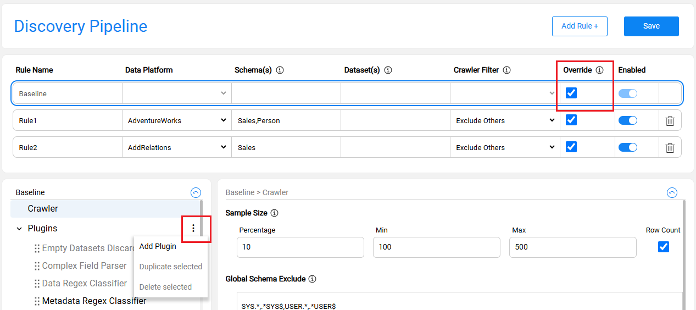
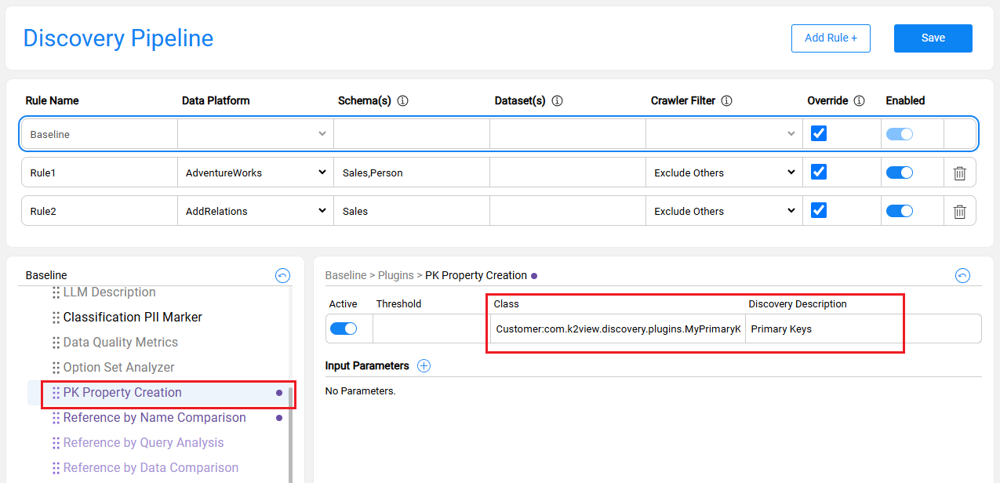

# Creating a Custom Discovery Plugin

## Overview

The Fabric Catalog solution includes a list of product plugins. When needed, the core solution can be extended with project-specific functionality. it is particularly useful when you need to tailor the core discovery process to specific business requirements, extending the Catalog's capabilities beyond the baseline configuration.

You can create plugins to add custom properties, define new relationships, or implement entirely custom behavior. Creating a custom discovery plugin involves two stages:

* [Plugin Development in Fabric Studio](06_creating_custom_discovery_plugin.md#plugin-development): Create and deploy a Java class within your Logical Unit.
* [Plugin Setup in Catalog](06_creating_custom_discovery_plugin.md#plugin-setup-in-catalog): Add the plugin to the Discovery Pipeline and execute the discovery process.

## Plugin Development in Fabric Studio

### Step 1: Create the Java Class

- Select the Logical Unit where the plugin will reside. The plugin is created within the LU's Java source code.
- In the Project's tree, navigate to `<LU>/Java/src/com/k2view`.
- Create a new folder named `discovery/plugins`.
- Create a new Java file (e.g., `MyCustomPlugin.java`).

### Step 2: Choose the Plugin Type

Extend the appropriate base class based on your plugin's intended purpose:

* For new custom properties logic, extend the core `PropertyPlugin` class:

  ~~~java
  public class MyCustomPlugin extends PropertyPlugin {
      // Your implementation here
  }
  ~~~

* For new relations, extend the core `RelationPlugin` class:

  ~~~java
  public class MyCustomRelationPlugin extends RelationPlugin {
      // Your implementation here
  }
  ~~~

* For fully custom logic, implement `Plugin` interface:

  ```java
  public class MyFullCustomPlugin implements Plugin {
      // Your implementation here
  }
  ```

### Step 3: Add Monitor Support

To ensure plugin's progress is visible in the Discovery Monitor, add status updates to your class:

* **For PropertyPlugin or RelationPlugin:** The platform handles progress tracking automatically. Use the following to update found items:

```java
MonitorStatusUpdater.getInstance().updateFound(pluginName, uid);
```

* **For Custom Plugins:** You must manage progress tracking manually by calling `updateStatus` when implementing the Plugin interface:

```java
updateStatus(pluginName, uid, count++);
```

### Step 4: Deploy the Logical Unit

After implementing the plugin class, **Deploy** the Logical Unit to make the plugin available within Fabric.

## Plugin Setup in Catalog

Follow these steps to setup the new plugin within the Catalog's pipeline:

1. Navigate to **Catalog app > Settings > Discovery Pipeline**.

2. Click **Override** on the Baseline rule to create a custom pipeline configuration.

3. In the **Plugins** section, click the **3 dots** icon to open the context menu.

   

4. Click **Add Plugin**, enter a name and press TAB.

   * The plugin name is a free-text string and does not have to match the class name. 
   * New plugins are added to the end of the list by default. You can reorder them using **drag & drop**.

5. Populate the **Class** field using the following format: `<LU_NAME>:<Full_Class_Path>`
   * For example: ```Customer:com.k2view.discovery.plugins.MyPrimaryKeyPlugin```.

6. Enter a **Discovery Description**. This text will appear in the Discovery Monitor.

   

7. Click **Save** to apply the changes. 

Once the plugin configuration is completed, run the discovery process to execute your custom plugin in action. 

For more information about the Discovery Pipeline settings and how to add a new plugin, click [here](https://support.k2view.com/Academy/articles/39_fabric_catalog/catalog_app/13_discovery_pipeline_settings.html).


