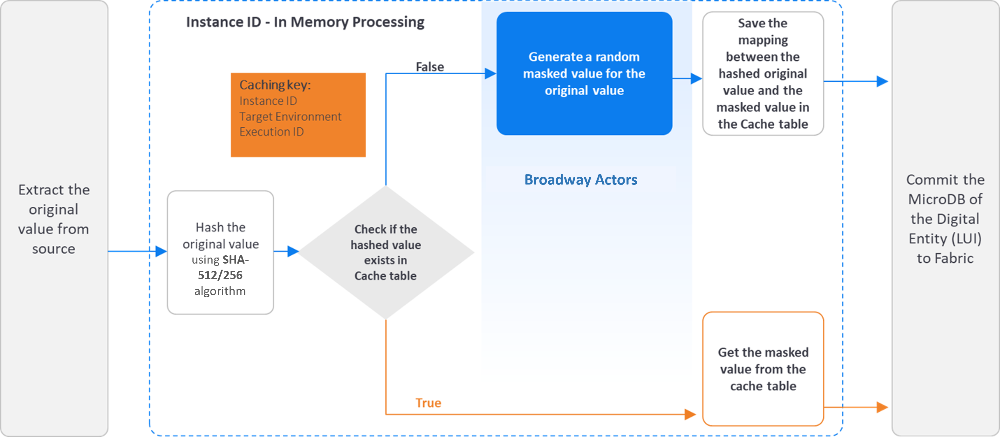
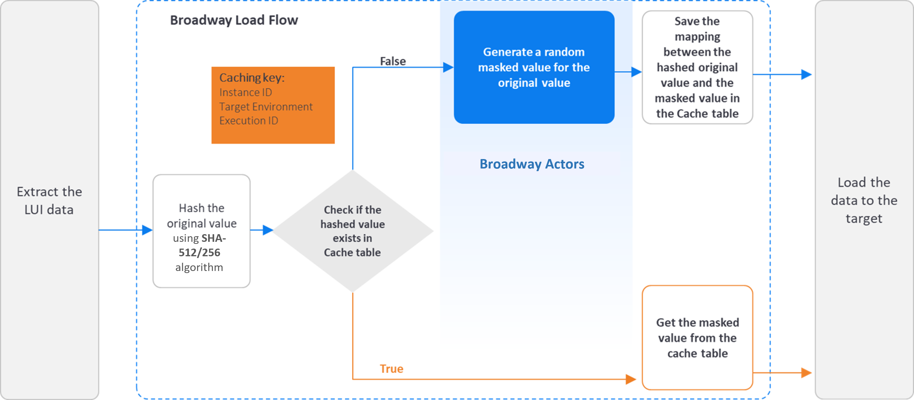

# Masking Flow

The masking of sensitive data can be done by either the [LU Table Population Broadway Flow](/articles/07_table_population/14_table_population_based_Broadway.md) that runs during the [LUI sync](/articles/14_sync_LU_instance/01_sync_LUI_overview.md) before saving the LUI in Fabric, or by using a Broadway flow to mask the LUI data before it is loaded to the target.

The masking process consists of 2 main parts:

- Data generation - generating a random masked value for the masked field.
- Data consistency - verifying that the same original value gets the same masked value. 

Fabric supports **2 methods** to keep the **data consistency**:

- Data consistency using **table**.
- Data consistency using **seed**.

The data consistency method is set based on the **interface** parameter of the **Masking** Actor: If the interface parameter is populated with **SEED**, the masking mechanism keeps the **Data consistency using seed** method.

### Data Consistency Using Table

The mapping between the hashed original and masked values is kept in a caching table, which is defined under the [k2masking schema](/articles/02_fabric_architecture/06_cassandra_keyspaces_for_fabric.md).

The following diagram describes the sensitive data masking process, using an **LUI sync**:

The following diagram describes the sensitive data masking process **before loading the data to the target**:

### Data Consistency Using Seed

This new method has been added in Fabric 8.2. and it ensures **referential integrity without saving the mapping between the hashed original value and the masked value in the caching table.** It can therefore lead to **better performance**, when compared to regular masking, as it does not need to access the DB. The mapping between the hashed original value and the masked value is not kept in the caching table, but rather in the **Java Random** method using a **seed**. A seed is like a starting point for generating random numbers, and it ensures consistency of the generated value.

If the Masking actor's **interface** input argument is populated with **SEED**, the masking Actor populates the **seed** with the [caching key](#caching-key---caching-level-parameters) and sends it to the **data generation Actor**.

This is available only if the data generation Actor has a seed input argument, and it uses the Java Random method to get the masked value when the input seed is populated. **All the [built-in data generation Actors](/articles/19_Broadway/actors/07a_data_generators_actors.md) support data generation based on seed**.

#### Notes:
- In both data consistency methods, Fabric uses the SHA-512 or SHA-512/256 algorithms to hash the original value. Additionally, Fabric uses a dedicated master key to salt the original value before hashing it. The hashing is a one-way activity. The hashed value cannot be reversed back to the original value.

  Click [here](/articles/26_fabric_security/02_fabric_entities_design.md#fabric-hashing-mechanism) for more information about the Fabric hashing mechanism.

- The Data Consistency Using Seed does not keep the referential integrity when the masked value is taken from a dynamic list: If the seed is identical, the random function will bring the same index from the list. It checks the index of the returned value and not the value itself. We therefore recommend to use the Data Consistency Using Table method for keeping the referential integrity in this case.

  For example, an [MTable](/articles/09_translations/06_mtables_overview.md) that contains a list of names is created at run-time. The 5th index is populated with 'Jonn' on the first run and 'Harry' on the second. If the first run gets 'John', the second run will get 'Harry' when running on the same seed as the first run. This happens because both names have the same index in this example. 

- The masked value is impacted not only by the seed, but also by the data generation parameters. For example, getting a random value between 0-100 returns a different result than when getting a random value between 0-200, even if they get the same seed value.
- The *Consistent and unique* consistency mode does not support data consistency using seed. Instead, it relies on tables within the k2masking schema to ensure both data consistency and uniqueness of masked values.

### Broadway Masking Actors

The masking process is executed by Broadway Actors that enable masking sensitive data before it is loaded into a target database or even into Fabric. The masking process contains the generation (manufacturing) of a random synthetic value that replaces the real value, and the caching of the hashed original value and the masked value in order to keep the referential integrity of the data. 
Starting from V7.1, Fabric separates data generation (manufacturing) from the hashing and caching capabilities. Broadway provides the following Actors: 

1. Various data generation Actors under the **generators** category to generate a random synthetic value. For example: RandomString, RandomNumber, Sequence...
2. **Masking** Actor - this Actor can wrap any data generation Actor and add the hashing and caching capabilities on top of the data generation Actor.
3. Broadway still keeps the existing masking Actors for backward compatibility reasons.

The masking Actors use the Fabric hashing utility to hash the original value, and to save the mapping of the hashed and the masked values to the cache table.

Click [here](/articles/19_Broadway/actors/07_masking_and_sequence_actors.md) to read how to use Fabric's masking Broadway Actors.

Click [here](02_fabric_entities_design.md#fabric-hashing-mechanism) to read more about the Fabric hashing mechanism.

#### Customized Masking Logic 

K2view enables users to create their own masking functions:
- The **MaskingLuFunction** Broadway Actor can be used to call a customized function (a shared function or an LU's function) - to mask the required field.  
- The **MaskingInnerFlow** Broadway Actor can be used to call a customized Broadway flow or an Actor - to mask the required field.
- Fabric 7.1 provides the general **Masking** Actor that enables running either a customized inner flow or an Actor - to mask a required field.

Click [here](/articles/19_Broadway/actors/07a_data_generators_actors.md#customized-data-generation-flows---implementation-guidelines) for more information about the data generators implementation.

The use of **MaskingLuFunction**, **MaskingInnerFlow** or **Masking** Actors guarantees the usage of the masking mechanism, including **SHA-512/256** hashing and caching capabilities. The user does not need to handle them by their customized function.

### Masking Actors Properties

#### Interface

- The interface to be used to cache the masked values. If the interface is populated with **SEED**, the **Masking** Actor populates the **seed** with the [caching key](#caching-key---caching-level-parameters) and sends it to the **data generation Actor**.

#### Target Value Uniqueness

- The user can decide whether the masked value is unique per original value (hashed value) or if it can be used for more than one original value. For example, a masked SSN must be unique, but a masked Family Name can be the masked value of different original values. 

#### Cache with Expiration Date

- Each cached link of a hashed value to a masked value can have a TTL (Time To Live). This link will expire once the TTL has been reached, and the original value will be masked again. 

#### Caching Key - Caching Level Parameters

- The caching of the masked values can be saved on different levels, based on the user’s input. Each one of the following parameters can be enabled or disabled from being a part of the **Caching key**:
  - Instance ID
  - Environment
  - Execution ID

#### Format Preserving Masking

Format-preserving masking, introduced in Fabric 8.0, provides a solution for maintaining **consistent data masking** across multiple fields while **preserving their original formatting** patterns. It addresses scenarios where **the same underlying value appears in multiple fields with different formatting patterns**.

Click [here](03_format_preserving_masking) for more information about format preserving masking.
