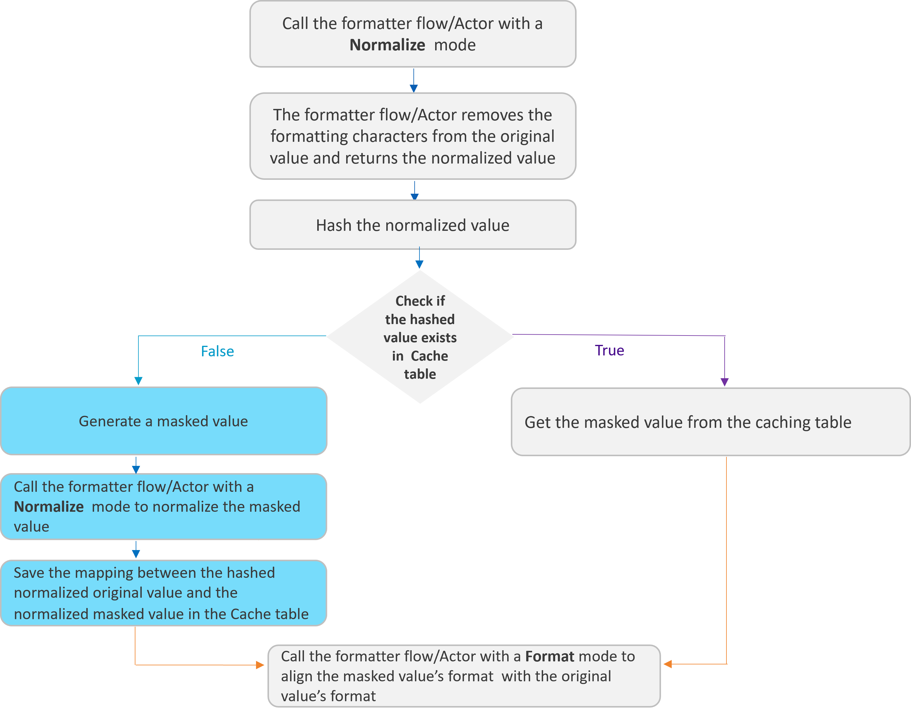

# Format Preserving Masking

Format-preserving masking, introduced in Fabric 8.0, provides a solution for maintaining **consistent data masking** across multiple fields while **preserving their original formatting** patterns. It addresses scenarios where **the same underlying value appears in multiple fields with different formatting patterns**.

An optional parameter has been added to the Masking Actor - **formatter** - to enable format-preserving masking. This parameter can be set with either a [formatter flow or an Actor](/articles/19_Broadway/actors/07_masking_and_sequence_actors.md#formatter-actors-and-flows) in order to **preserve the original format in the masked value** and to set the same masked values to all fields that have the same normalized (’naked‘) value, although each field has a different format.

Example:

- The phone number exists in multiple fields in the data source in different formats: +1 (254) 455 5666, +1(254)4555666, +1 (254)-455-5666.
- All these fields must get the same masked value (as they correspond to a single phone number), but the format needs to be different for each field in order to match its original format.

<table>
<tbody>
<tr>
<td width="232">

<strong>Original Value</strong>

</td>
<td width="205">

<strong>Masked Value</strong>

</td>
</tr>
<tr>
<td width="232">

+1 (254) 455 5666

</td>
<td width="205">

+1 (254) 430 8992

</td>
</tr>
<tr>
<td width="232">

+1(254)4555666

</td>
<td width="205">

+1(254)4308992

</td>
</tr>
<tr>
<td width="232">

+1 (254)-455-5666

</td>
<td width="205">

+1 (254)-430-8992

</td>
</tr>
</tbody>
</table>

The following diagram describes how the Masking Actor uses the formatter for preserving the original format in the masked value:

Click [here](/articles/19_Broadway/actors/07_masking_and_sequence_actors.md#formatter-actors-and-flows) for more information about the formatter flows and Actors.

