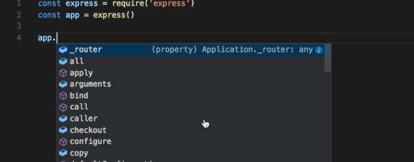
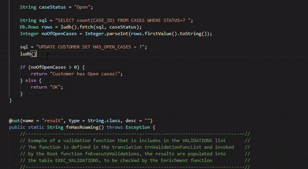
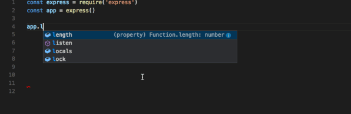
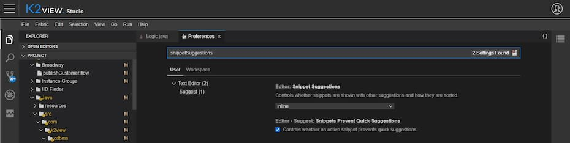

# IntelliSense

IntelliSense is a general term for various code editing features including: code completion, parameter info, quick info, and member lists. IntelliSense features are sometimes called by other names such as "code completion", "content assist", and "code hinting."

Web Studio IntelliSense is provided for Java, JavaScript, TypeScript, JSON, HTML, and CSS.

## IntelliSense features

Web Studio IntelliSense provides intelligent code completions based on language semantics and an analysis of your source code, where its suggestions will pop up as you type. If you continue typing characters, the list of members (variables, methods, etc.) is filtered to only include members containing your typed characters. Pressing `Tab` or `Enter` will insert the selected member.

You can trigger IntelliSense in any editor window by typing `Ctrl+Space` or by typing a trigger character (such as the dot character).

IntelliSense supports both the base language suggestions as well Fabric dedicated code type of variables and methods, as shown in the below illustration.

> **Tip:** The suggestions widget supports CamelCase filtering, meaning you can type the letters which are upper cased in a method name to limit the suggestions. For example, "cra" will quickly bring up "createApplication".

You can see **quick info** for a method, when supported, either pressing `Ctrl+Space` or clicking the info icon. The accompanying documentation for the method will now expand to the side. The expanded documentation will stay so and will update as you navigate the list. You can close this by pressing `Ctrl+Space` again or by clicking on the close icon.

After choosing a *method* you are provided with **parameter info**.

When applicable, the underlying types will appear in the quick info and method signatures. 

### Tab Completion

The editor supports "tab completion" which inserts the best matching completion when pressing `Tab`. This works regardless of the suggest widget showing or not. Also, pressing `Tab` after inserting a suggestions will insert the next best suggestion.

By default, tab completion is disabled. Use the **Settings > Preferences** to enable it: Click on the bottom left **Setting** button, then choose **Open Preferences** (or use `Ctrl+,` shortcut) and then type `Tab Completion`.

These values exist:

* `off` - (default) Tab completion is disabled.
* `on` - Tab completion is enabled for all suggestions and repeated invocations insert the next best suggestion.
* `onlySnippets` - Tab completion only inserts static snippets which prefix match the current line prefix.

### Suggestion selection

By default, Web Studio pre-selects the previously used suggestion in the suggestion list. This is very useful as you can quickly insert the same completion multiple times. If you'd like different behavior, for example, always select the top item in the suggestion list, you can use the `Suggest Selection` setting, available at **Settings > Preferences**.

The available `editor.suggestSelection` values are:

* `first` - Always select the top list item.
* `recentlyUsed` - (default) The previously used item is selected unless a prefix (type to select) selects a different item.
* `recentlyUsedByPrefix` - Select items based on previous prefixes that have completed those suggestions.

"Type to select" means that the current prefix (roughly the text left of the cursor) is used to filter and sort suggestions. When this happens and when its result differs from the result of `recentlyUsed` it will be given precedence.

When using the last option, `recentlyUsedByPrefix`, Web Studio remembers which item was selected for a specific prefix (partial text). For example, if you typed `co` and then selected `console`, the next time you typed `co`, the suggestion `console` would be pre-selected. This lets you quickly map various prefixes to different suggestions, for example `co` -> `console` and `con` -> `const`.

### Snippets in suggestions

By default, Web Studio shows snippets and completion proposals in one widget. You can control the behavior with the `snippetSuggestions` setting, available at **Settings > Preferences**. To remove snippets from the suggestions widget, set the value to `"none"`. If you'd like to see snippets, you can specify the order relative to suggestions; at the top (`"top"`), at the bottom (`"bottom"`), or inline ordered alphabetically (`"inline"`). The default is `"inline"`.

