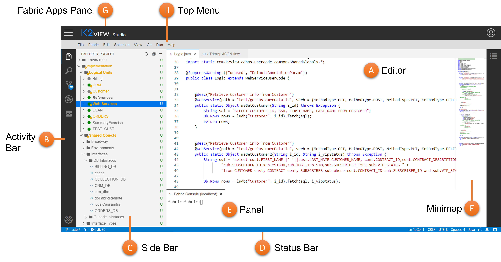

# User Interface

Fabric Web Studio comes with a simple and intuitive layout. Like many other code editors (also called IDE - Integrated Development Environment), it adopts a common user interface and layout,  maximizes the space provided for the editor while leaving ample room to browse and access the full context of your project.

## Basic Layout

 The UI is divided into several main areas:

* **Editor** (A) - The main area to edit all your project files and entities. You can open as many editors as you like side by side vertically and horizontally.
* **Activity Bar** (B) -  Located on the far left-hand side and lets you switch between views and gives you additional context-specific indicators, like the number of outgoing changes when Git is enabled.
* **Side Bar** (C) - Contains different views like the Explorer to assist you while working on your Fabric project.
* **Status Bar** (D) - Information about the opened project and the files you edit.
* **Panels** (E) - Enables you to see different panels below the editor region for debug information, compilations errors and warnings, or the integrated Fabric console. Panels can also be moved to the right for more vertical space.
* **Minimap** & **Outline** (F) = Code outline, Gives you a high-level overview of your source code, which is useful for quick navigation and code understanding. A file's minimap is shown on the right side of the editor. You can click or drag the shaded area to quickly jump to different sections of your file. Minimap is shown only for some of the editors, mainly code editors, and in such case you can also click on the **Outline** icon at top right, which when expanded it shows the symbol tree of the currently active editor.

In addition, layout contains a **top menu** (H) where you can make either of IDE operations as well as activate some Fabric commands. The Web Studio works as part of the Fabric Web Platform, where you can navigate to its other apps via the **Fabric Apps Panel** (G).  

>**Tip:** You can reorganized editors elements or reorder them. Drag and drop the editor title area to reposition it. You can do it either at the Editor (A) area as well as at Panel (E) area.

## Activity Bar and Views

The **Activity Bar** lets you quickly switch between views. Once you click on a view, the **Side Bar** is changed accordingly and let you to make the relevant operations for this view. 

Web Studio comes with several default views at the Activity Bar, as descried below. You can open those as well as other views also using the **View: Open View** command. In case a selected view does not appear yet in the Activity Bar, it will be added then. 

The views which appear by default at the Web Studio are as follows:

<table>
<tbody style="vertical-align: text-top; ">
<tr>
    <td style="text-align: center; padding-top: 10px;"></td>
    <td style="padding-left: 30px;"><strong>File Explorer</strong></td>
    <td style="width:60%">Used to browse, open, and manage all of the files and folders in your project. When selected, the Side Bar shows the project tree, enabling you to open files or make some other actions using the context menu, as well as use the context menu on folders level which contains also Fabric Studio actions by context. A badge appears on the Explorer icon at the Activity Bar showing how many files are currently edited without save.</td>
</tr>
<tr >
<td style="text-align: center; padding-top: 10px;"></td>
<td style="padding-left: 30px;"><strong>Search</strong></td>
<td style="width:60%">Provides global search and replace across your project files.  Search tool, which opened at the Side Bar lets you to make smart search using various filters.</td>
</tr>
<tr>
    <td style="text-align: center; padding-top: 10px;"></td>
    <td style="padding-left: 30px;"><strong>Source Control</strong></td>
    <td style="width:60%">Web Studio includes Git source control by default. Selecting the icon will show you the details of your current repository changes and also will let you to compare those changes to the origin, as well as making various source control actions. A badge appears on the Source Control icon at the Activity Bar showing how many changes you currently have in your repository</td>
</tr>
<tr>
    <td style="text-align: center; padding-top: 10px;"></td>
    <td style="padding-left: 30px;"><strong>Debug</strong></td>
    <td style="width:60%">Web Studio Run and Debug View displays variables, call stacks, and breakpoints. To learn more how to debug your project see [here]().</td>
</tr>
<tr>
    <td style="text-align: center; padding-top: 10px;"></td>
    <td style="padding-left: 30px;"><strong>Log Viewer</strong></td>
    <td style="width:60%">Enables to select and view Fabric logs, in rich and useful mode. When clicked it lets you, at the Side Bar to select which log to open. To learn more about Log Viewer and use it effectively see [here]().</td>
</tr>
</tbody>
</table>

>**Tip:** You can reorder views on the Activity Bar by dragging and dropping them.

  

## Command Palette

  

>**Notes:** 
>
>1. Fabric Web Studio is basically Visual Studio Code like editor and yet it different. While you can look and learn from VS Code vast user guides, you shall keep in mind that they are not the same.
>2. Fabric Web Studio follows currently Fabric .Net Studio concept in terms of being code editor oriented, file and folder based.
>3. Fabric Web Studio is fully compatible and compliance with the .Net Studio. You can smoothly switch between them while implementing your project.
