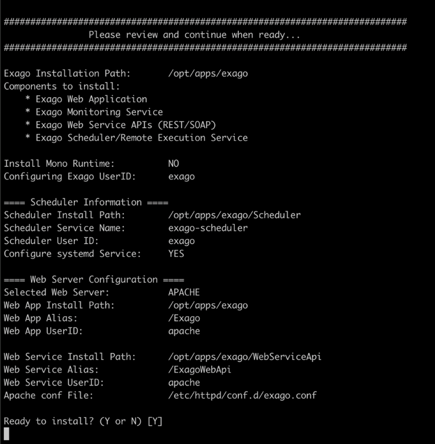

# ExagoBI Installation

## Introduction

This article describes the installation of ExagoBI. In order to complete the configuration and implementation of BI within Fabric, follow all the steps described in [BI User Guide](/articles/38_bi_integration/00_BI_user_guide_overview.md).

## Prerequisites

- Apache web server is pre-installed.
- SELinux is disabled.

## Installation Process

1. Click here (*TBD to add a link to K2View download page*) to download the ExagoBI Installer into a temporary directory.

2. Open a CLI, move to the temporary directory and extract the downloaded file by running the following commands:

   ~~~bash
   tar -zxvf ExagoInstaller_v2021.1.9.192.tgz
   cd installer
   ./InstallExago.sh
   ~~~

3. Follow the wizard:

   

   

**Directory Locations**

In this guide we use the **/opt/apps/exago** path as the path of ExagoBI installation.

<table style="border-collapse: collapse; width: 100%;">
<tbody>
<tr>
<td style="width: 50%; height: 18px;">Application Binaries</td>
<td style="width: 50%; height: 18px;">/opt/apps/exago/bin</td>
</tr>
<tr>
<td style="width: 50%; height: 18px;">API for Exago Web Service</td>

<td style="width: 50%; height: 18px;">/opt/apps/exago/WebServiceApi</td>
</tr>
<tr>
<td style="width: 50%; height: 18px;">3rd Party’s Utilities</td>

<td style="width: 50%; height: 18px;">/opt/apps/exago/Utilities</td>
</tr>
<tr>
<td style="width: 50%; height: 18px;">3rd Party’s Drivers</td>

<td style="width: 50%; height: 18px;">/opt/apps/exago/Drivers</td>
</tr>
<tr>
<td style="width: 50%; height: 18px;">Personalization Configuration</td>

<td style="width: 50%; height: 18px;">/opt/apps/exago/Config</td>
</tr>
<tr>
<td style="width: 50%; height: 18px;">Exago Report Scheduler</td>
<td style="width: 50%; height: 18px;">/opt/apps/exago/Scheduler</td>
</tr>
</tbody>
</table>

## Configuration Files Update

TBD - by script?

## Access ExagoBI

Once the installation and configuration files update is completed, ExagoBI can be accessed via the **K2View Web Framework** > **BI**. 

In demo or development environments it is possible to configure ExagoBI to be accessed directly using the following URLs:

* Administration Console: http://<host>/Exago/Admin.aspx
* Designer: http://<host>/Exago/ExagoHome.aspx

Click here to learn how allow the [direct access to ExagoBI](/articles/38_bi_integration/99_bi_admin_config.md#allow-direct-access).

