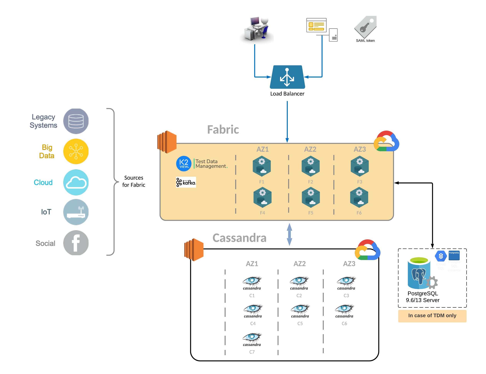

# Fabric & TDM 7.xx Hardware Requirements

### INTRODUCTION

These articles provide information regarding hardware, software, and operating system requirements for Fabric and TDM 7.xx installations. 
Separate requirements are presented when working in a Development/Quality Assurance environment, and when working in a Production environment.
It is assumed that the reader is familiar with Fabric and/or TDM.  

### DIAGRAM 

The diagram below depicts a generic system layout for Fabric and Test Data Management (TDM) projects. The number of Fabric, Cassandra and Kafka nodes can vary and should be based on a sizing assessment done for each project.

  
