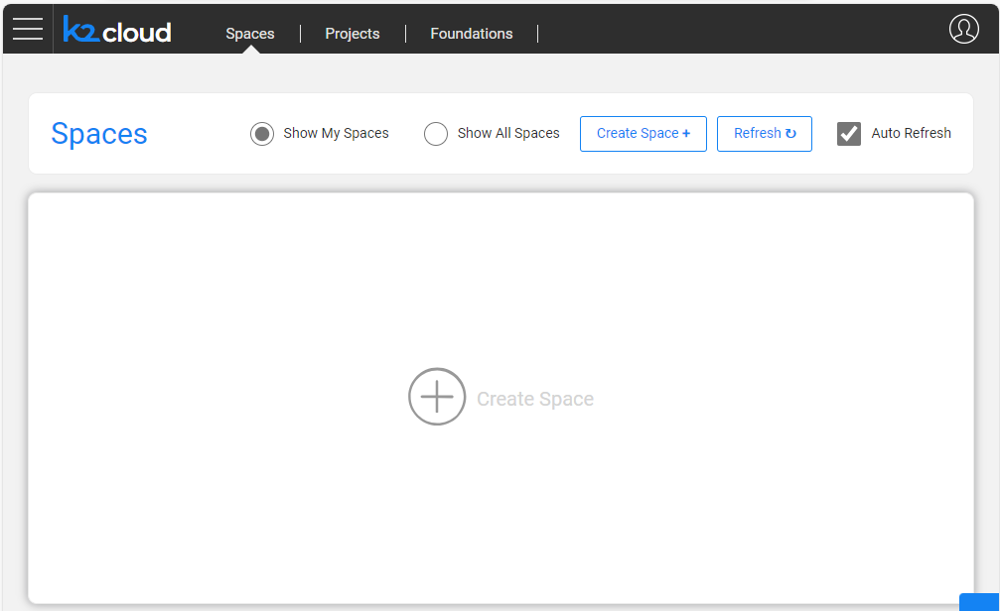
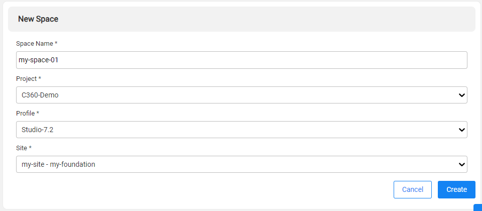
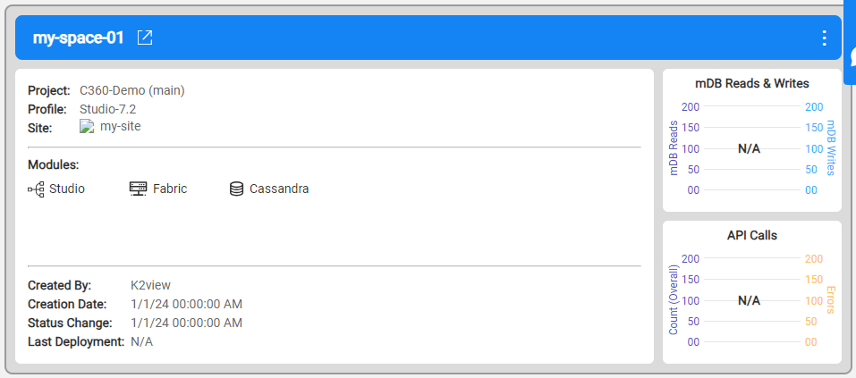

# Requirements and Prerequisites for Hybrid On-Premise K2view Cloud Installation 

## Hardware requirements 
A Kubernetes worker node is expected to meet the following requirements:

<table>
<tbody>
<tr>
<td valign="top">
<p><strong>CPU</strong></p>
</td>
<td>
<p>4 cores (minimum) or 8 cores (recommended)</p>
<p>64-bit CPU architecture</p>
</td>
</tr>
<tr>
<td>
<p><strong>RAM</strong></p>
</td>
<td>
<p>16 GB RAM (minimum) or 64 GB RAM (recommended)</p>
</td>
</tr>
<tr>
<td valign="top">
<p><strong>Storage</strong></p>
</td>
<td>
<p>Serving Studio namespaces: 150 GB SSD disk (minimum)</p>
<p>Serving Fabric cluster namespaces: Storage shall be calculated according to the project's estimated needs.</p>
</td>
</tr>
</tbody>
</table>

## Prerequisites 
* An A record on public domain, pointing the the server that will host the kubernetes node (can point either private or public IP).
* An asterisks certificate (with private key) for the selected domain.

>   For test and POT Environment domain and certificates can be provided by K2view.

* A user with sudo privilege to run the script.
* Kubernetes/Docker images (will be provided by K2view, Depend on the required projects)
* FW access to GitHub and K2view Cloud manager at port 443 (https). 
* Mailbox ID and Cloud manager URL (will be provided be K2view) to be used by Kubernetes module K2view-agent (more explanation below)  

 

## Kubernetes components and the K2view-agent 

The script provided will automatically install and configure everything that's required to have Kubernetes running and ready to be access K2view Cloud Manager. In Linux, Kubernetes will be installed using MicroK8s (https://microk8s.io/) along with some additional controllers. Although some might be optional, NGINX must be used as ingress controller 

 
The k2view-agent is a module used to bridge the communication from K2view Cloud Manager to the Kubernetes cluster. It will retrieve all the deployment instructions from K2view Cloud Manager from your cluster's dedicated mailbox (the Mailbox Id will be provided by K2view). With that, no inbound connection is required in the server running Kubernetes, only outbound traffic to K2view Cloud Manager URL. The K2view-agent will be deployed using helm. 

 

 

## Installation 

Clone Git repository 'k2view/blueprints' in GitHub 

```bash
git clone https://github.com/k2view/blueprints.git
```

Navigate to directory 'blueprints/baremetal' 

```bash
cd blueprints/baremetal
```

Run script 'single_node.sh'  and follow all the in-screen instructions 

```bash
./single_node.sh
```
This script will install the following tools:
* cert-manager - more info at <a href="https://cert-manager.io/" target="_blank">https://cert-manager.io/</a>
* NGINX Ingress - more info at <a href="https://docs.nginx.com/" target="_blank">https://docs.nginx.com/</a>
* hostpath-storage
* docker registry - more info at <a href="https://microk8s.io/docs/registry-built-in" target="_blank">https://microk8s.io/docs/registry-built-in/</a>
* metrics-server

During the installation installer will request to provide the prerequisites:
* Mailbox ID
* Cloud manager URL
* DNS Record

Once the setup finishes (it can take several minutes), and before we can create new space, few steps need to be taken:
* Load the downloaded docker images
```bash
docker load -i /path/to/file.tar.gz
```
* Tag the image to fit the local repository
```bash
docker tag <IMAGE_HASH> localhost:32000/image-name:tag
```
* Import the downloaded images to the Kubernetes local repository.
```bash
docker push localhost:32000/image-name:tag
```
* Deploy it in the nginx namespace and restart nginx controller
```bash
deploy_certificate.sh
```

open the K2view Cloud Manager portal using the internet browser of your preference and create a space. After this space starts, you can begin using the application!

To start new space
* Click the **create Space +**

* Add the required details (Space Name, Project Name, Etc)

* Wait for the space to be created 

 
