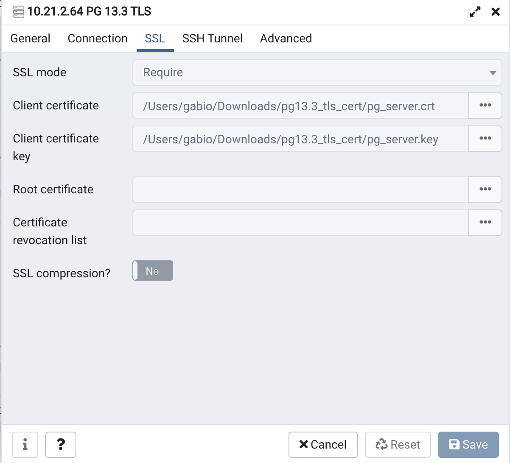

# Setup for PGSQL 13.3

When using TDM, you need to have a Postres SQL database engine. This document shows how to install such an engine. 

TDM 7.xx is certified to be used with PGSQL 9.6 & 13. 
- You can supply access to a Postgres SQL database engine if you have one. If you do not, one is supplied with the TDM application.  
- TDM requires a username & password with full create, delete and update privileges. 
- You also have the option install a Postgres SQL database engine from the K2View predefined **tarball** file.
- The tarball that is supplied by **K2view** is PGSQL 13.3 with the TLS mode enabled. 
- The user and password are **postgres**, port is the default port (5432).  
 
Locations of important files are as follows:
- Certification files:  /opt/apps/pgsql/bin/.crt 
- Configuration files:  /opt/apps/pgsql/data 

## Hardware and OS Requirements

- RedHat/CentOs 8, AWS Linux 2
- 2 vCPU
- 8G RAM
- 100G free disk space, make sure it is assigned to `/opt/apps/pgsql`
  
## Preliminary Steps ##
  
  Add the following users:

~~~bash
mkdir -p /opt/apps
chmod 755 /opt/apps
useradd -m -d /opt/apps/pgsql pgsql

#### add the following packges for RHEL/CentOs 8
dnf install -y compat-openssl10 readline* glibc-locale-source glibc-langpack-en
ln -s /usr/lib64/libreadline.so /usr/lib64/libreadline.so.6
~~~

## Setup  ##

- Connect as the  **pgsql** user on the console of the server.

- Download or copy the tarball file from this link: [pg13.3_tls_enabled.tar.gz](https://owncloud-bkp2.s3.us-east-1.amazonaws.com/adminoc/TDM/PG%20image/pg13.3_tls_enabled/pg13.3_tls_enabled.tar.gz).

- Download the cert file from this link:  [pg13.3_tls_cert.zip](https://owncloud-bkp2.s3.us-east-1.amazonaws.com/adminoc/TDM/PG%20image/pg13.3_tls_enabled/pg13.3_tls_cert.zip)

- Copy the files to the Fabric instance that runs TDM, and place them here: $K2_HOME/.pg_cert/ (you will need to create this directory)

- Untar the `pg13.3_tls_enabled.tar.gz` as follows: 

  ~~~bash
  tar -zxvf pg13.3_tls_enabled.tar.gz && bash -l
  ~~~

- Start the **pgsql** using the following commands: 

  ~~~bash
  cd bin/
  ./pg_ctl -D /opt/apps/pgsql/data -l logfile start
  ~~~

- You can stop the **pgsql** using the following commands:
   
  ~~~bash
  ./bin/pg_ctl -D /opt/apps/pgsql/data -l logfile stop
  ~~~

- Run the following commands from the server console to create the TDM database and the **tdm** user:

  ~~~bash
  createuser tdm --login --superuser
  createdb -O tdm TDMDB
  echo "ALTER USER tdm WITH PASSWORD 'tdm';"| psql
  echo "ALTER USER postgres WITH PASSWORD 'postgres';"| psql
  echo "ALTER USER postgres WITH SUPERUSER;"| psql
  ~~~

- Connect via a pgadmin, then log in as the **tdm** user and run the contents of `TDMGUI/createTDMDB/k2vtdm2.sql`  and `TDMGUI/createTDMDB/k2vtdm3.sql` 
- Alternatively, you can copy the files to the pgsql console and run them with the **psql** command. 
  The files are located at ~/ k2vtdm2.sql ~/ k2vtdm3.sql

  Example:
   
  ~~~bash
  cd ~/
  psql -d TDMDB -f -a ~/k2vtdm2.sql
  psql -d TDMDB -f -a ~/k2vtdm3.sql
  ~~~

## How to Connect From pgadmib4 in TLS Mode

Connect via a pgadmin and set this up as shown in the example below:

        

### Check That the Connection is Secure

- From the server side, run the following command from the console:

~~~sql
echo "SELECT datname,usename, ssl, client_addr FROM pg_stat_ssl JOIN pg_stat_activity ON pg_stat_ssl.pid = pg_stat_activity.pid;" | psql
~~~

- The output should look like the following:

~~~test
datname  | usename  | ssl |  client_addr
----------+----------+-----+---------------
 postgres | postgres | t   | 10.212.134.59
 postgres | postgres | t   | 10.212.134.59
 postgres | postgres | t   | 10.212.134.59
 postgres | postgres | t   | 10.212.134.59
 pgsql    | pgsql    | f   |
(5 rows)
~~~

- As a pgadmin, run the following script:

~~~sql
  SELECT datname,usename, ssl, client_addr
  FROM pg_stat_ssl
  JOIN pg_stat_activity
  ON pg_stat_ssl.pid = pg_stat_activity.pid;
~~~

​	

### **Fabric Implementation Guidelines**

**Edit the TDM Interface**

- Set the **Custom Connection String setting to true** and add **&ssl=true** to the connection string. 
  
  Example:
  
  

  Verify that the TDM interface is defined using the Generic DB format (Database Type is genericdb).

- Redeploy the project to Fabric. 

**Edit the Environments**

- Open and edit all Environments: check the Custom Connection String checkbox of the TDM interface and add **&ssl=true** to the TDM’s connection string. 
- Redeploy the Environments to Fabric.

  

