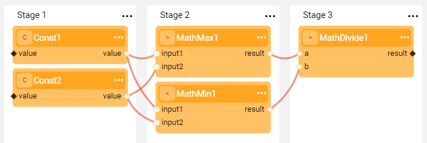
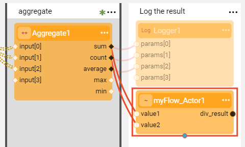

# Inner Flows

### Inner Flow Actor Types
Broadway enables the execution of a Broadway flow in another flow. This function can be used when the same logic needs to be executed in several flows. 

An inner flow can be executed by three [built-in Actor types](04_built_in_actor_types.md):

* **InnerFlow** Actor, executes a Broadway flow. Input and output arguments reflect the inputs and outputs of external arguments to and from the inner flow.
* **InnerFlowAsync** Actor, executes a Broadway flow asynchronously in a thread pool. When called, the Actor returns immediately once a working thread becomes available. When the flow is completed, the Actor waits for all threads to be completed. 
* **InnerFlowJoin** Actor, waits for all pending tasks of an **InnerFlowAsync** Actor to be completed. The **remaining** output argument (number of flows remaining to be completed) of the **InnerFlowAsync** Actor must be connected to the **remaining** input argument of the **InnerFlowJoin** Actor. The Actor is completed once the number of remaining tasks is 0.

### Save As Actor
An inner Broadway flow can also be created using the **Save as Actor** action in the [Main menu](18_broadway_flow_window.md#main-menu) of the Broadway flow window. This method saves the current flow as a new Actor whereby its logic can be reused in another Broadway flow. When a new Actor is created, it inherits from the **InnerFlow** Actor. 

**Example of Saving an Actor and Using it in Another Flow**

1. Create a flow that incapsulates a specific business logic. For example, given two input numbers, divide a bigger number by a smaller number. 

   

2. Save the flow as a new Actor. For example, if the flow name is **myFlow**, the new Actor's name will be **myFlow_Actor**.

4. Add a new Actor to another flow.

   

