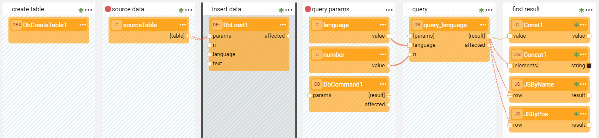
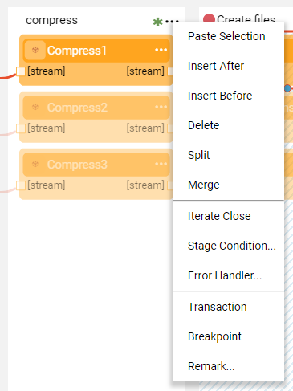
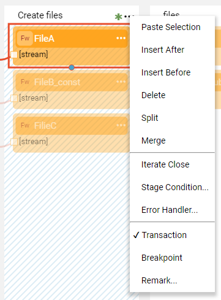

# Transactions

Broadway has a built-in Transactions Management mechanism. 

In a Broadway flow, a **Transaction** is marked by blue diagonal lines in the Stage background and can span across several [Stages](19_broadway_flow_stages.md).

 

Each Stage of a flow can be marked as a transaction. 

- The transaction starts when the Actor in the first Stage marked as Transaction requests to start a connection. 
- Several sequential Stages marked as Transactions are part of the same transaction.
- The transaction ends in the last Stage marked as Transaction and is followed by a commit. The transaction is rolled back if there are errors. 

A transaction can be defined on DB-related activities as well as on different types of entities. For example writing into a file. When a Broadway flow writes into a file, the end of Transaction closes the file. 

Transactions can include [inner flows](22_broadway_flow_inner_flows.md). If a transactional Stage executes an inner Broadway flow, the flow automatically becomes a part of the outer transaction.

### How Do I Mark or Unmark a Stage as a Transaction?

To mark a Stage as a transaction, click  to open the [Stage context menu](/18_broadway_flow_window.md#stage-context-menu) > **Transaction**.

To unmark a Stage, uncheck **Transaction** in the [Stage context menu](/18_broadway_flow_window.md#stage-context-menu).

