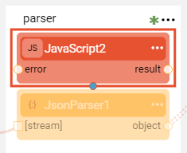
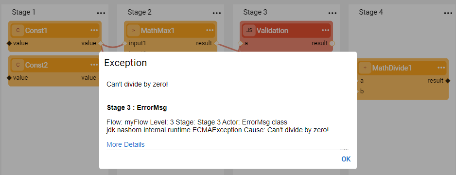
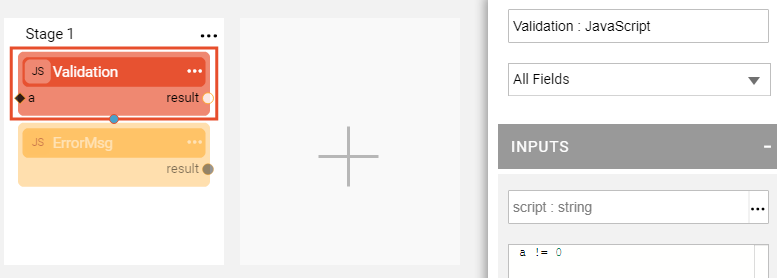
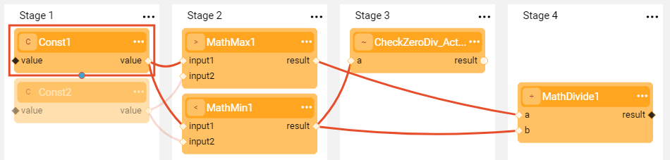
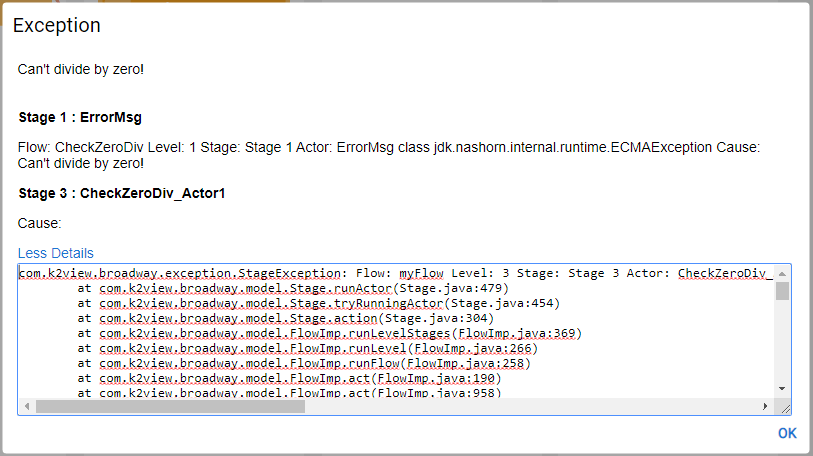

# Error Handling

Broadway enables the Error Handling mechanism by the ability to assign an **Error handler** to any [Stage](19_broadway_flow_stages.md) of the flow. Any [Actor](03_broadway_actor.md) can act as an error handler. The logic to be validated by the error handler is the Actor's logic. 

- If an error handler returns true - the flow continues.

- If an error handler returns false - the flow stops.

If the selected error handler is a **JavaScript** Actor, the custom logic can be included in the **script** input parameter. 

Error handling can also be done using an [Inner flow](22_broadway_flow_inner_flows.md) functionality. This is recommended when the same error handling validation should be performed in several flows.

### How Do I Add an Error Handler to a Stage?

To add an error handler to a Stage, click  in the right corner of the Stage to open the [Stage context menu](18_broadway_flow_window.md#stage-context-menu) and select **Error Handler** to [add an Actor to the Stage](03_broadway_actor.md#how-do-i-add-actor-to-stage). The added Actor will be red indicating that it's an error handler.

**Example of Error Handler in a Flow** 

1. Create a flow with required business logic, for example: given two input numbers, divide a bigger number by a smaller number. 

2. Prior to the division in Stage 4, check that the smaller number is not equal to zero - using an Error Handler **JavaScript** Actor named **Validation** in Stage 3 of the flow. 

   

3. If the smaller number is zero, throw an error using a **JavaScript** Actor named **ErrorMsg**. Stage 4 is not executed in this case since the error handler stops the flow execution. 

   

**Example of Error Handling Using an Inner Flow**

1. Create a simple flow which performs a validation and throws an error. For example, check that input number is not zero and if it is - throw an exception. 

   - The validation is implemented using a **JavaScript** Actor set as **Error Handler** which includes the validation check: *a != 0*.
   - The exception is implemented using a **JavaScript** Actor which throws an exception if Error Handler returns false: *throw "Can't divide by zero!"*.

   

2. Save the flow and then [save the flow as Actor](22_broadway_flow_inner_flows.md#save-as-actor). The flow name is **CheckZeroDiv** and the new Actor's name is **CheckZeroDiv_Actor**.

3. Add a new Actor to another flow called **myFlow** which requires this validation. The inner flow is added to Stage 3 of **myFlow**. If at run time the error occurs (min number = 0), the exception will be thrown and the flow will stop.

   

4. The exception displays the message that helps to identify in which flow and at which Stage the error occurred. If the error occurred in the inner flow, it shows the name and the Stage of the inner flow too.

   In the example below, the following information is displayed in the error message:

   **Flow**: myFlow **Level**: 3 Stage: **Stage 3 Actor**: CheckZeroDiv_Actor1  

   **Cause**:  InnerFlowException: **Flow**: CheckZeroDiv **Level**: 1 Stage: **Stage 1 Actor**: ErrorMsg  class jdk.nashorn.internal.runtime.ECMAException **Cause**: Can't divide by zero!

   

5. It is possible to perform several validations using different inner flows. For example, in addition to the above - add a validation that input numbers are not negative and if yes - throw an exception and stop the flow prior to the division step. This check will also be implemented by creating another flow, saving it as an Actor and adding it to the current flow.

   

   

