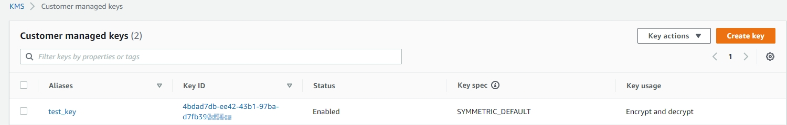
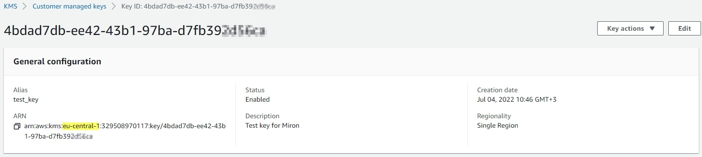
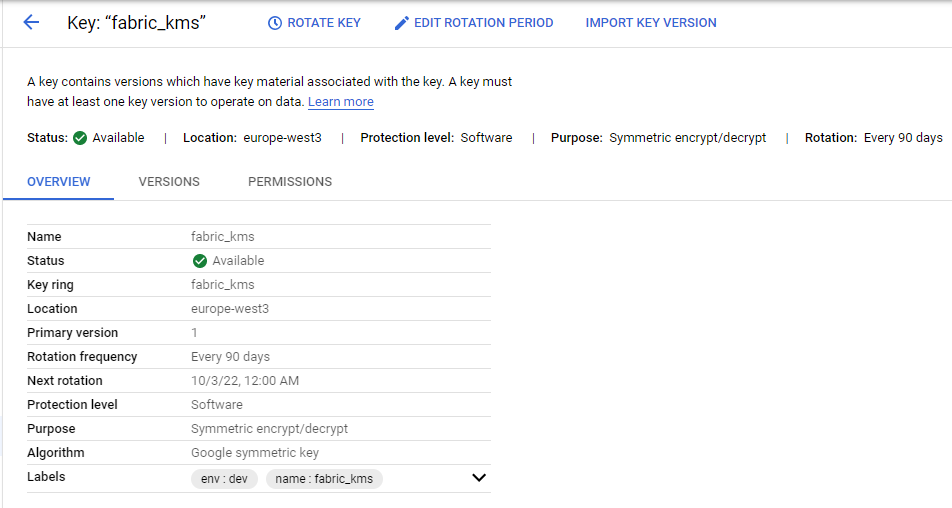

# Fabric Master Key Integrated with KMS

Fabric master key mechanism can be integrated with KMS, as described [here](/articles/26_fabric_security/02_fabric_entities_design.md#kms).

To define Fabric to work with KMS, the information shall be acquired first from KMS and then shall be set at Fabric.
> By default, Fabric uses its internal master key mechnaism 

## Integration with AWS KMS

1. Get from KMS the specific customer master key information - region and customer master key ID

   - *Key ID*, can be seen in the KMS keys list, for example

     

   - *Region*, the region name where the CMK is created. Note that keys are created per region. For more information about multi region support see [here](). You can see the region (as well as the ID) also when drilling down into the key page, from the key list page (KMS > Customer Managed Keys):

     

2. Get from AWS the user IAM access credentials: access key ID and its secret access key.

   - This user shall be granted with appropriate permissions to the specific KMS customer master key. The associated users can be also found at the key page > key policy section. 

3. At Fabric, Set the values at config.ini under ``[encryption_aws_kms]`` section, according to the KMS information. 

   > Note: This shall be done at all Fabric nodes. 

   ~~~
   [encryption_aws_kms]
   ACCESS_KEY_ID=
   SECRET_ACCESS_KEY=
   REGION=
   CUSTOMER_KEY_ID=
   ~~~
   >  Note: Relevant parameters are encrypted and are not saved at the file in their clear/plain form.

4. At Fabric, run ``activatekey name='masterkey_key_name' generatorType='AWS_KMS' storeType='AWS_KMS'``.

### Multi Region Support

For multi region Fabric deployment it might be required to work with [AWS multi region keys](https://aws.amazon.com/blogs/security/encrypt-global-data-client-side-with-aws-kms-multi-region-keys/), for a better perfromance. In such case, config.ini shall be set different among Fabric nodes, i.e. with relevant region replicated keys.

## Integration with GCP KMS

1. Get from KMS the specific master key information - product/project ID, location, master key ID, keyring ID

   

2. Get from GCP the user access credentials, as JSON file, which can be achieved when creating the user. 

   - This user shall be granted with appropriate permissions to the specific KMS master key. At least "*Cloud KMS CryptoKey Encrypter/Decrypter*" role shall be assigned to that user.

3. At Fabric:

   - Set the values at config.ini under ``[encryption_gcp_kms]`` section, according to the KMS information.

   - Locate the credential file at Fabric machine and populate its full path location at ``CREDENTIAL_FILE`` parameter. Alternatively, credentials file can set as environment variable called *GOOGLE_APPLICATION_CREDENTIALS*.

   >  Note: These actions shall be done at all Fabric nodes. 
   ~~~
   [encryption_gcp_kms]
   PRODUCT_ID=
   LOCATION_ID=
   KEY_ID=
   KEY_RING_ID=
   CREDENTIAL_FILE=
   ~~~
   >  Note: Relevant parameters are encrypted and are not saved at the file in their clear/plain form.

## Symmetric and Asymmetric Master Key Encryption Types

While KMS providers enable working with either symmetric and asymmetric encryption types, Fabric supports the symmetric type. This type shall be selected at KMS when creating the master key. 

