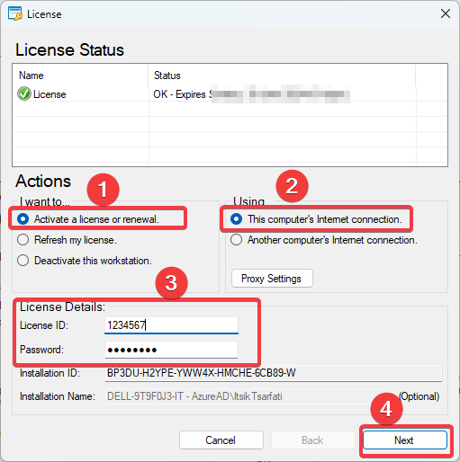
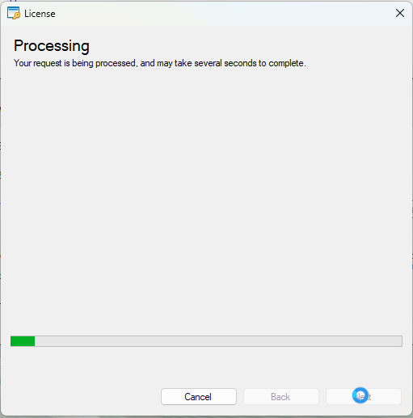
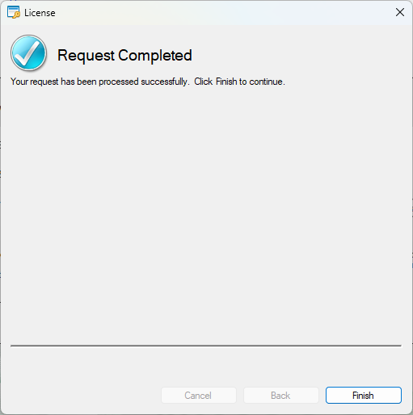
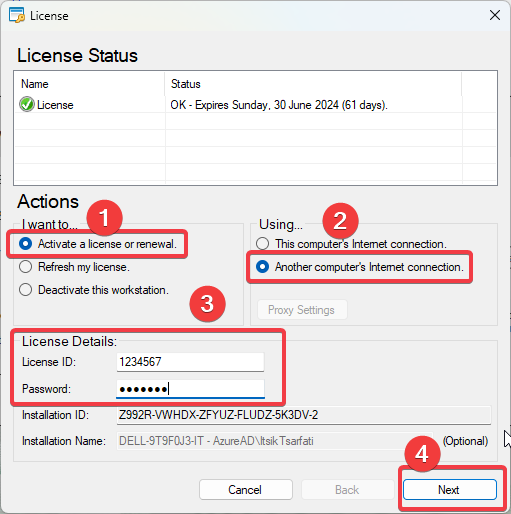
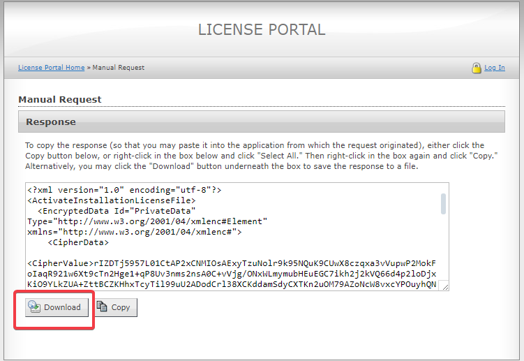
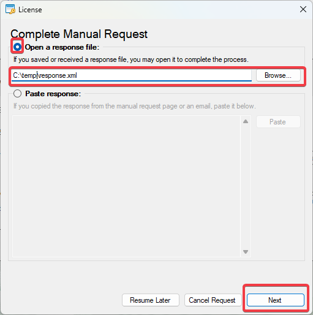
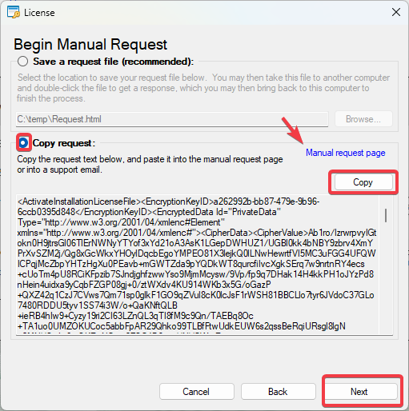
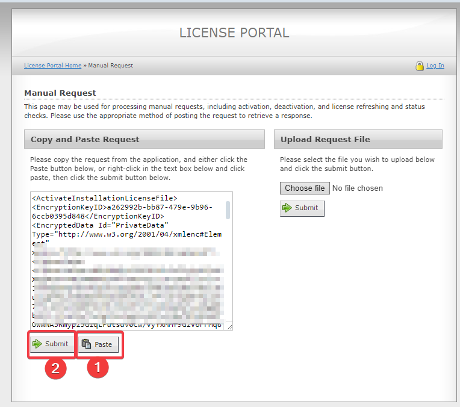
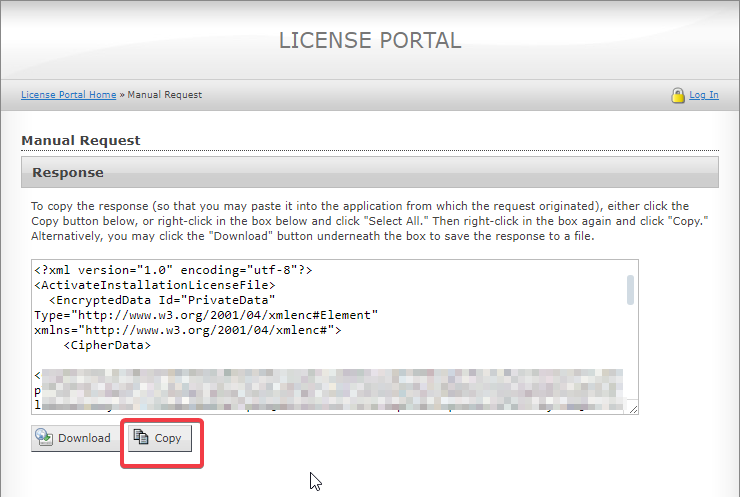
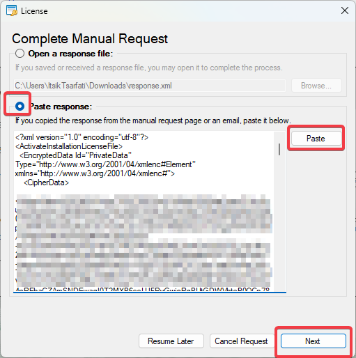

# Fabric Studio License Activation

Fabric License is managed remotely to control and monitor validations (to verify that number of installations and licenses' expiration dates). For this reason, an active Internet connection is required for an initial activation of the license.
for this process, in case Fabric Studio is installed on a server with no Internet access, an external station with Internet access should be used.

#### Prerequisites
License ID and Activation password (will be provided by View Account manager).

#### Online Activation
The simplest activation is as follows: 
* Select the 'Activate a license or renewal.' option under Actions/'I want to...'.
* Select 'This computer's Internet connection.' under Actions/'Using...'.
* Enter your provided license details (License ID and Password).
* Click 'Next'.
* Wait for the activation request to complete and then click 'Finish' to resume your work.

  

#### Manual Activation - Method A
File transfers is allowed.
* Select the 'Activate a license or renewal.' option under Actions/'I want to...'.
* Select 'Another computer's Internet connection' under Actions/'Using...'.
* Enter your provided license details (License ID and Password).
* Click 'Next'.
* Select a location for the request file (HTML file) and click 'Next' to save it (keep the activation windows open until the process has been completed).
* Transfer the file to a computer with an Internet access and open it with your browser.
* Download the Response file (XML file) and transfer it back to the server.
* Browse for the response file and click 'Next' to finish the process.

#### Manual Activation - Method B
File transfers is not allowed.
* Select the 'Activate a license or renewal.' option under Actions/'I want to...'.
* Select 'Another computer's Internet connection' under Actions/'Using...'.
* Enter your provided license details (License ID and Password).
* Click 'Next'.
* Copy the request text (keep the activation windows open until the process has been completed).
* Open the manual request page on your computer: [https://license.k2view.com/solo/customers/ManualRequest.aspx](https://license.k2view.com/solo/customers/ManualRequest.aspx)
* Paste the request text in the text box and click 'Submit'.
* Copy the Response text.
* Paste the Response text back to the server and click 'Next'.

