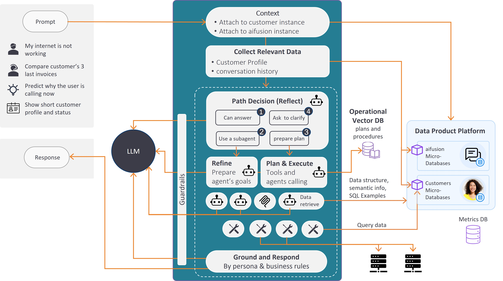

# Agent Framework: The Agentic Flow

The aifusion framework orchestrates AI agents behavior through a structured decision-making process. This article explains how the Orchestrator evaluates user queries and determines the optimal response path.

The framework consists of several built-in workflow orchestrating agents, represented by Broadway actors and flows. In addition, other agents - worker subagents - are involved in the agentic flow process, either built-in or implementation.

| Agent                | Role                                                         |
| -------------------- | ------------------------------------------------------------ |
| **Orchestrator**     | Manages the overall agentic flow                             |
| **Reflector**        | Part of Orchestrator; evaluates user queries                 |
| **Refiner**          | Refine the user’s request into a concise, complete goal description for the selected sub-agent, using conversation history and context |
| **Planner**          | Part of Orchestrator; creates and executes task plans        |
| **Worker Subagents** | Execute dedicated tasks using specialized tools              |

## Orchestration and Decision Making

### High-Level Flow

The high-level flow begins with retrieving the business entity and conversation LUIs to establish full context. The core of the response process is handled first by the **Orchestrator** flow.

The Orchestrator uses AI to *reflect* on the user question, *refining* it based on conversation history, and *deciding* the best path forward.

1. **Retrieve Context** — Fetch the business entity and conversation LUIs to establish full context
2. **Reflect on Query** — The Orchestrator uses AI to refine the user question based on conversation history
3. **Determine Path** — The reflection determines one of three primary response paths
4. **Execute and Respond** — Delegate to the appropriate agent and formulate the final answer

### Response Paths

The *Reflector* evaluates the user's question and determines the best path forward:

| Path                                     | Description                                                  | When to Use                                                  | Performance                                                |
| ---------------------------------------- | ------------------------------------------------------------ | ------------------------------------------------------------ | ---------------------------------------------------------- |
| **Have All Info** (1)                    | moving on to the Responder to formulate the answer           | Information exists in business entity story, conversation history, or is generic public knowledge | **Fastest**                                                |
| **Call Worker Specialized Subagent** (2) | Route to a specialized subagent for the domain               | Questions relate to specific domains (e.g., credit card issues) | **Faster and more accurate** due to focused goal and tools |
| **Build a Plan** (3)                     | Call the Planner agent  to build and execute a step-by-step plan | Multiple actions and steps are needed like calling several subagents and tools | Most **flexible** but slower                               |
| **Clarify** (4)                          | Ask the user to clarify his question                         | User's question is not clear and cannot be understood from context | Fast                                                       |

### Flow Delegation

Once a path is chosen, the flow is **delegated** to the relevant agent, so that the the selected agent becomes responsible for preparing the complete answer. Finally the *Responder* collects responses from any path and crafts the final answer. At the Responder the organizations can set rules for answer formatting according to business and legal directives.

## Utilizing Subagents

A worker subagent is a tagged Broadway flow (e.g., with `loans_subagent` tag) to handle a specific domain or request type (banking loans). 

### Subagent Discovery

The Reflector agent:

1. Looks for flows with agent tags
2. Examines their descriptions
3. Identifies the specialized agent best suited for the current task

Orchestrator then calls the Refiner agent to prepare the subagent's goal according to user request and context.

##### Notes:

> 1. Use the subagent [Broadway flow's properties](/articles/19_Broadway/33_flow_properties.md) to add tags and description.
> 2. Agent tags are specified as attribute of the *Orchestrator* agent. Providing it all flows which are tagged as subagents can confuse and overwhelmed the agent to choose the right sub-agent.

When invoking a subagent, it receives detailed context, including:

- Its **Role and Objectives** (as a system message).
- **Domain Data** (details on relevant LUs, reference tables, column names, and descriptions) to enable dynamic SQL query construction.
- A specific **List of Tools** (other Broadway flows) tailored to the domain.

## The Planner Approach

If a request requires gathering information or executing multiple steps but does not fit a predefined subagent, the `orchestrator_planner` is triggered.

The LLM is tasked with generating a step-by-step execution plan using several resources:

1. **Sample Plans:** JSON files (e.g., `Banking_plans.json`) containing pre-built templates showing the LLM how to combine tools to accomplish similar objectives.
2. **Tools List:** A full list of available Broadway flows, along with descriptions and remarks added to input parameters. The LLM uses these descriptions to choose the right tool and determine the required inputs. Tools can be also subagents. 
3. **Corporate Procedures:** Documents indexed in the vector repository that define business rules or step-by-step instructions (e.g., verification criteria for credit limit reduction).

Once the plan steps are prepared, it executes them step-by-step. 

> Note: It is a best practice to rely on subagents for high-performance needs, as the Planner approach is slower and less predictable due to the required plan generation step.

