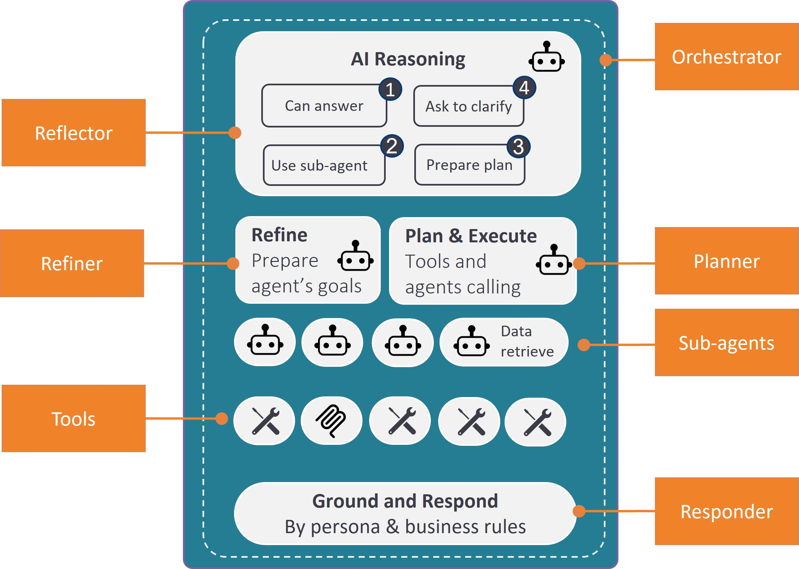

# Agentic Flow & Agents in Practice

This article provides a practical, implementation-focused guide to the agents that participate in the Agentic Flow within the AI Fusion framework.

While [The Agentic Flow](04_agentic_flow.md) article explains the conceptual execution model — how decisions are made, how paths are selected, and how responsibilities are delegated — this article translates these concepts into actual agents, focusing on how to set built-in agent attributes and how to create, configure, and reference sub-agents.

The following diagram illustrates a typical agentic flow, as viewed from the perspective of AI Fusion agents and tools:

## The Orchestrator

When the conversation entry-point flow calls the Orchestrator actor, it passes several inputs. These inputs and attributes are then used by the Orchestrator flow itself and by its complementors - Reflector, Refiner and the Planner. All these flows can be considered building blocks that you do not need to touch. 

| Input                      | Description                                                  | Example                                           |
| -------------------------- | ------------------------------------------------------------ | ------------------------------------------------- |
| `userQuery`                | The user's question or request                               | "What is my credit card balance?"                 |
| `synopsis`                 | Business entity story/summary                                | "David Smith, Retail customer, 2 credit cards..." |
| `toolMTable`               | The MTable name containing the tool tag list and their definitions, which shall be used.  It is used by the *Planner* to tighten and limit which tools can be used, while Planner agent evaluates whether and which tools to use. | `Banking_tool_tags`                               |
| `subagents_tag`            | A tag used for identifying the sub-agents available for this flow.  This is used by both the *Reflector*, to look for and identify matching sub-agents, and by the *Planner*, when evaluating whether and which sub-agent to use. | `Banking_subagent`                                |
| `responderPrompt`          | Guidelines for grounding the final response to the conversation caller (end user). They usually include rules and instructions for formalizing the answer. | `TBD`                                             |
| `searchProceduresFlowName` | A flow used for retrieving corporate procedures.  The procedures are used by the *Planner*, where this flow is responsible to bring the relevant procedures to augment the Planner context prompt. Procedures are usually brought by using vector store search. | `Banking_searchProcedures`                        |
| `searchPlanFlowName`       | A flow used for retrieving sample plans.  These samples are used by the *Planner*, where this flow is responsible to bring the relevant them to augment the Planner context prompt, helping it to build a plan. Plans are usually brought by using vector store search. | `Banking_searchPlan`                              |

## The Planner

If a request requires gathering information or executing multiple steps but does not fit a predefined sub-agent, the `orchestrator_planner` is triggered.

The LLM is tasked with generating a step-by-step execution plan using several resources:

1. **Tools and Agent List:** A list of available and relevant (by tags) Broadway flows, along with descriptions and remarks added to input parameters. The LLM uses these descriptions to choose the right tool and determine the required inputs. Relevant sub-agents (by tag) are also providers. 
2. **Sample Plans** (Optional): JSON files (e.g., `Banking_plans.json`) — containing pre-built templates — that show the LLM how to combine tools to accomplish similar objectives.
3. **Corporate Procedures** (Optional): Documents indexed in the vector repository that define business rules or step-by-step instructions (e.g., verification criteria for credit limit reduction).

Once the plan steps are prepared, it executes them step-by-step. 

> Note: It is a best practice to rely on sub-agents for high-performance needs, as the Planner approach is slower and less predictable due to the required plan generation step.

## The Worker Sub-agents

A worker sub-agent is a tagged Broadway flow (e.g., with `loans_subagent` tag) to handle a specific domain or request type (e.g., banking loans). 

### Sub-agent Discovery

The Reflector agent:

1. Looks for flows with agent tags
2. Examines their descriptions
3. Identifies the specialized agent best suited for the current task

When an appropriate subagent is found, the Orchestrator then calls the Refiner agent to prepare the subagent's goal according to user request and context.

##### Notes:

> 1. Use the sub-agent [Broadway flow's properties](/articles/19_Broadway/33_flow_properties.md) to add tags and description.
> 2. Agent tags are specified as attribute of the *Orchestrator* agent. Providing it all flows which are tagged as sub-agents can confuse and overwhelmed the agent to choose the right sub-agent.

### Sub-agent Card

#### Input

When invoking a subagent, it receives detailed context, including:

- Its **Role and Objectives** (as a system message).
- **Domain Data** (details on relevant LUs, reference tables, column names, and descriptions) to enable dynamic SQL query construction.
- A specific **List of Tools** (other Broadway flows) tailored to the domain.

#### Logic 

A typical sub-agent includes a combination of logic steps along with LLMAgent actor usage. In this way a better controlled and reliable flow is achieved.

The LLMAgent decides on tools activation and response formulation according to:

1. **Predefined Domain Data** - Retrieved using a DBCommand actor
2. **Schema Information** - Relevant tables for SQL crafting
3. **System Prompt** - Agent goals and behavioral guidelines
4. **User Prompt** - The refined user query
5. **Tool List** - Available tools the AI can invoke

> Use Broadway [flow properties](/articles/19_Broadway/33_flow_properties.md) to add tags and descriptions to subagent flows. The framework uses these to select the appropriate agent for each request.

