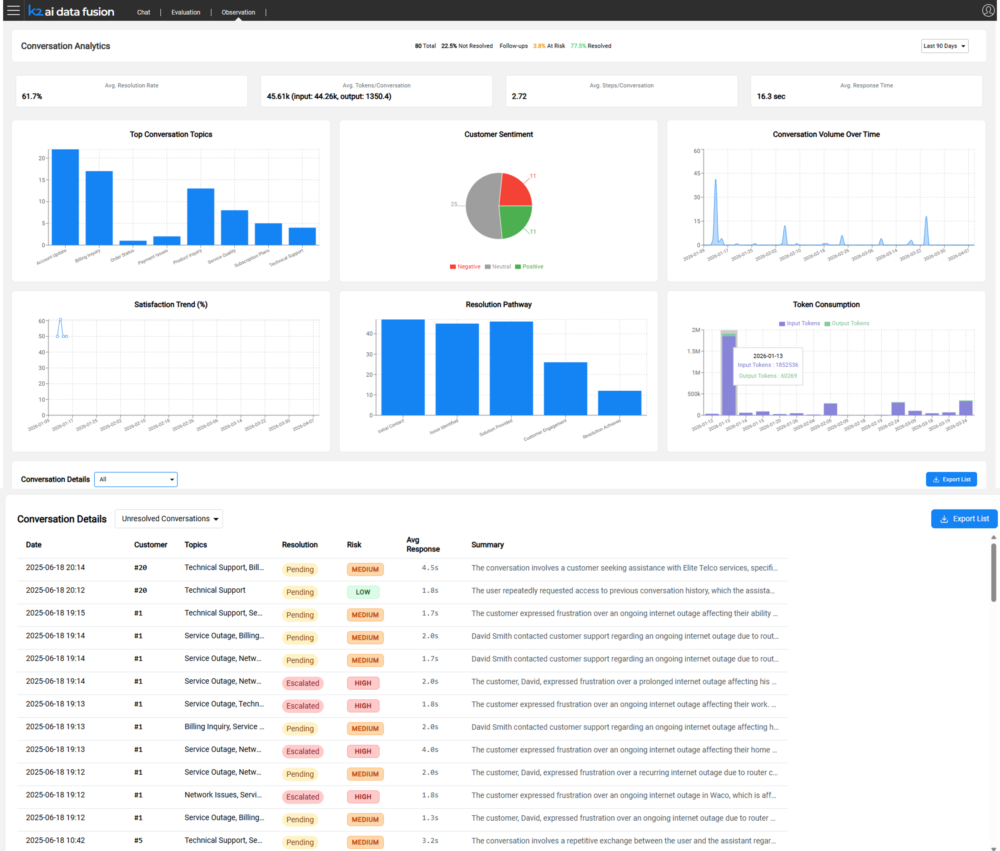

# Observation

The **Observation** module provides production-level visibility into AI agent behavior. Where the [Evaluation Framework](/articles/AI_fusion/03_evaluation/00_intro_to_evaluation.md) validates quality before deployment, Observation monitors what actually happens after agents go live: capturing every conversation, scoring it, and surfacing the results through a configurable analytics dashboard.

## The Production Visibility Challenge

Design-time testing covers known scenarios. Production introduces unknowns: real users ask unexpected questions, data changes, and edge cases that no test suite anticipated begin to surface. Without structured monitoring, teams have no reliable way to detect quality regressions, identify systemic issues, or measure improvement over time.

Manual conversation review does not scale. An agent handling thousands of sessions per day cannot be monitored by sampling alone. What is needed is automated analysis that covers every conversation and surfaces the ones that require attention.

Observation addresses this by automatically collecting and analyzing every AI session, using an LLM-as-a-Judge approach to tag and score conversations without requiring human reviewers for routine monitoring.

## What Observation Collects

Observation captures data across three perspectives for every production session.

### Operational

Every step of the agent's execution is recorded:

- **LLM calls** - model used, full prompts sent, responses received, latency per call
- **Agent invocations** - which agents were called, in what sequence, with what context
- **Tool calls** - which tools were invoked, their inputs and outputs, execution duration
- **Execution traces** - the complete reasoning path from user message to final response

This data supports

* Root-cause analysis when a conversation produces a poor outcome.
* Learning from good outcomes, as AI prompts examples.

### Finance

Token and cost data is recorded at the level of individual calls and attributed to the agent or module that generated it:

- Input tokens, cached tokens, and output tokens per LLM call
- Model attribution (which model was used for each call)
- Agent and module attribution (which part of the flow consumed which resources)

This enables cost allocation, budget tracking, and optimization of expensive agentic flows.

### Behaviors

The full conversation is stored and enriched with quality signals:

- Complete message history (user turns and assistant turns)
- User feedback - thumbs up / thumbs down ratings and free-text notes submitted by users
- Conversation metadata — session ID, customer ID (IID), application ID, timestamp, submitted-by

## Conversation Auto-Tagging

After each conversation completes, and the data was collected, as explained above, an LLM analyzes it and assigns a set of structured tags. These tags power the dashboard filters and allow teams to find specific conversation types without reading every session.

<table>
<tbody>
<tr>
<td><strong>Tag</strong></td>
<td><strong>Values</strong></td>
<td><strong>What it captures</strong></td>
</tr>
<tr>
<td><strong>Topic</strong></td>
<td>Free-text label</td>
<td>The primary subject of the conversation</td>
</tr>
<tr>
<td><strong>Sentiment</strong></td>
<td>Satisfied / Neutral / Dissatisfied</td>
<td>The user's apparent emotional state</td>
</tr>
<tr>
<td><strong>Resolution Status</strong></td>
<td>Resolved / Not Resolved</td>
<td>Whether the user's need was met</td>
</tr>
<tr>
<td><strong>Risk Level</strong></td>
<td>Scored indicator</td>
<td>Potential compliance, accuracy, or reputational risk</td>
</tr>
<tr>
<td><strong>Follow-up Required</strong></td>
<td>Yes / No</td>
<td>Whether the conversation needs human follow-up</td>
</tr>
</tbody>
</table>

### Operation

 Note: Tags are not generated automatically at the end of each conversation. Analysis must be triggered explicitly by running a Broadway flow. Two flows are available:

* **`RunAnalyze.flow`** — processes all open sessions from the last N days, one session at a time. Trigger via the REST API: `GET /run-analytics?day={N}`, or directly in Fabric: `broadway aifusion.RunAnalyze 'day'='N'`.
* **`runBatchChatAnalyzePipeline.flow`** — uses the OpenAI Batch API for large-volume processing at reduced cost (~50% cheaper per session). Suitable for high-traffic production environments.

Both flows read signal definitions from the `chat_signals.csv` MTable and store results in the INSIGHTS table.

> **Note:** To keep dashboard data current, schedule `RunAnalyze.flow` to run at regular intervals (e.g., nightly). 

For setup and configuration, see [Configuring Observation](03_configuring_observation.md).

