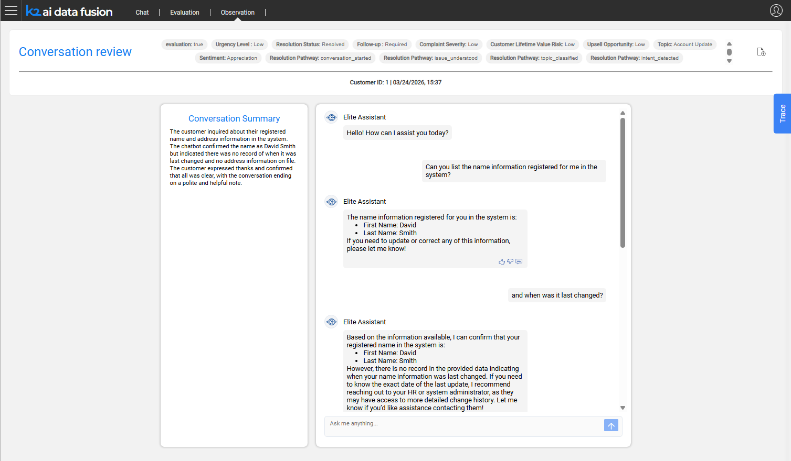
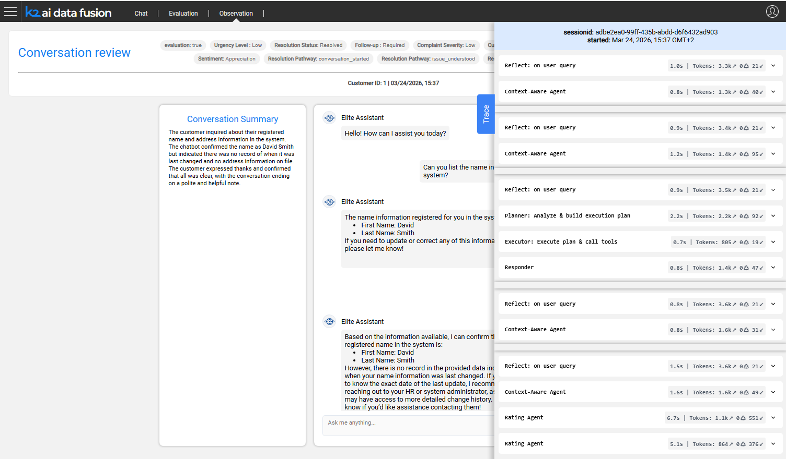

# Conversation Review

The Conversation Review page provides a full drill-down into a single production session. It shows the complete message exchange, the auto-generated quality tags, the user's feedback, and the detailed execution trace, giving teams everything they need to understand what happened in a conversation and decide what action to take.

Navigate to a conversation review by clicking any row in the [Observation Dashboard](01_observation_dashboard.md) conversation table.

## Page Layout

The conversation review page is organized in four sections:

1. **Header** - conversation tags, export button, and key metadata
2. **Conversation Summary** - LLM-generated summary of the session
3. **Chat History** - the full message exchange with user feedback indicators
4. **Trace Panel** - the agent execution detail behind each assistant turn

## Conversation Tags

The header displays the auto-tags assigned to the conversation by the LLM judge. These provide an at-a-glance quality assessment without reading the full transcript.

<table>
<tbody>
<tr>
<td><strong>Tag</strong></td>
<td><strong>Description</strong></td>
</tr>
<tr>
<td><strong>Topic</strong></td>
<td>The primary subject of the conversation (e.g., "billing inquiry", "account balance")</td>
</tr>
<tr>
<td><strong>Sentiment</strong></td>
<td>User's apparent satisfaction: Satisfied, Neutral, or Dissatisfied</td>
</tr>
<tr>
<td><strong>Resolution Status</strong></td>
<td>Whether the conversation ended with the user's need met: Resolved, Pending, or Escalated</td>
</tr>
<tr>
<td><strong>Risk Level</strong></td>
<td>A risk assessment indicating potential compliance, accuracy, or reputational concerns: Low, Medium, or High</td>
</tr>
<tr>
<td><strong>Follow-up Required</strong></td>
<td>Whether the conversation warrants human follow-up</td>
</tr>
</tbody>
</table>

## Conversation Information

Alongside the tags, the header shows:

- **Customer ID** - the IID (Logical Unit Instance) associated with the session
- **App ID** - the AI Fusion application that handled the conversation
- **Date / Time** - when the session occurred

## Conversation Summary

Below the header, an LLM-generated summary card condenses the conversation into a short paragraph. This allows reviewers to quickly understand the session's content and outcome without reading every turn.

The summary is generated automatically by the same batch tagging process that produces the conversation tags.

## Chat History

The chat history section renders the full conversation as an exchange of user and assistant messages - the same format the user experienced in production.

### User Feedback

Where users submitted feedback during the conversation, indicators appear alongside the relevant assistant turn:

- **👍 / 👎** - thumbs up or thumbs down rating
- **Note icon** - indicates the user added a written comment; click to expand the note text

Feedback from this view is read-only. To submit feedback programmatically or from the Chat Playground, see [Feedback Integration](/articles/AI_fusion/02_agent_framework/14_feedback_integration.md).

## Trace Panel

The trace panel exposes the execution detail behind each assistant response. For each turn it shows:

- **LLM calls** - the model, prompt sent, response received, and latency
- **Agent invocations** - which agents were called and their inputs/outputs
- **Tool calls** - which tools were used, with their inputs, outputs, and duration

Use the trace panel to diagnose why a response was incorrect or slow - for example, to identify a tool that returned unexpected data, or an LLM call with a malformed prompt.

## Exporting a Conversation

Click the **Export** button in the header to download the conversation as a ZIP archive. The export dialog offers an option to include a **LUI data snapshot** - a frozen copy of the customer data (mDB) at the time of the session.

<table>
<tbody>
<tr>
<td><strong>Export option</strong></td>
<td><strong>Use case</strong></td>
</tr>
<tr>
<td><strong>Without LUI data</strong></td>
<td>Share the transcript for review; lightweight</td>
</tr>
<tr>
<td><strong>With LUI data</strong></td>
<td>Full reproducibility; recreates the exact data state</td>
</tr>
</tbody>
</table>

The ZIP format is compatible with the Evaluation module's import function.

## From Observation to Evaluation

Production conversations can be imported directly into the Evaluation workspace as test cases:

1. Export the conversation as a ZIP from the Observation review page
2. In the Evaluation workspace, use the **Import** function to load the ZIP
3. Review the conversation, edit expected answers if needed, and save it as a test case

This closes the quality loop - real production failures become regression tests, ensuring the same issue cannot recur undetected. See [Data Snapshots and Production Import](/articles/AI_fusion/03_evaluation/09_data_snapshots_and_production_import.md) for the full workflow.

