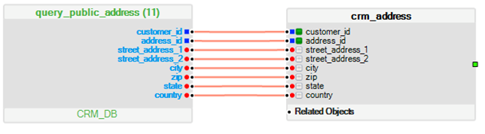

# LU & Tables

1. Table Population: 

    * Always consider the order in which the table is populated.

    * Set up **Truncate mode** if the population extracts all data for a given instance.

      **NOTE:** The  **Truncate mode**  setting on the population level truncates the entire table (even if it was set on the 3rd population, for example).

    * Set up **No Truncate mode**  if the population extracts a delta from the source.

    * It is recommended to set up the **Insert**  mode on the 1st population. 

    * Make sure indexes are defined on the source database for the **where**  statement columns (LUDB Schema link fields).

    * Limit the number of link fields to the minimum required to fetch the relevant instance data.

2. LUDB / Reference Queries:  

   - Mark the key fields of each table and set them as a unique index. 
   - Create the relevant indexes based on your statement.
   - Creating the correct indexes improves the performance of SELECT, UPDATE, and DELETE statements, but will slow down the performance of INSERT statements. 
   - If not created correctly, indexes may slow the performance of SELECT, UPDATE, and DELETE statements. Therefore, it is recommended to execute **explain query plan** to validate that the correct indexes are being utilized. 
   - If you apply additional manipulation/transformation in the query on the index fields, it will not be used. For example,  concatenation of two fields in the WHERE statement. In this case, even if there is an index on those fields, it will not be used.
   - If needed, enforce the index utilization in the query using **INDEXED BY**. If it is fails upon parsing, use **/\* sqlite \*/ or /\* k2_no_parse \*/** before the SELECT (depending on the Fabric version). 
   - Simplify queries used to achieve better performance and readability.
   - Avoid using the JOIN operator too many times in the same query. Consider splitting the query to several simple queries.
   - Avoid using the UNION operator too many times. Additionally, use UNION ALL if the data being retrieved by the sub queries is unique. This will improve the performance as each UNION instance adds another action between the results of the queries, and this adds time.    
   
3. To validate that a record exists, select the first row with the required WHERE condition using **limit 1** or **rownum < 2**, depending on which database is being used. 

   - Do not use **count(\*)** in the query as this is time consuming.

4. Remove fields from the LU that are not used in the project (with the customer’s approval). 

5. If iidFinder is being utilized, many UPDATE messages might become redundant (update of fields which do not exist in the LU). Therefore, filtering should be applied (either on the extract or in the GG replicated code which writes to Kafka).

6. Regarding root functions not using the INPUT field as part of the query or in the function logic, consider the following points:

   * If these populations are connected to the logical parent and the input is not being used in the query when there is more than one distinct value for the input, the function will be executed multiple times. 
   * Connect the population to the root table.
   * If connecting the population to the root table cannot be done due to other logical constraints (for example a **delete orphans**  functionality), a thread global should be used to make sure this population is executed only once.

7. Do not set the Table Population on top of the LUDB to automatically run every second. This population should be executed only when the source tables are being updated, so in most cases this should be based on a DECISION function.

8. When using the Table Population UPDATE  mode, make sure the tables’ key fields are marked. Otherwise, all records will be updated for each iteration, resulting in all records being updated with the last iteration data. Data from previous iterations will not be updated. 

   Example: 

 
