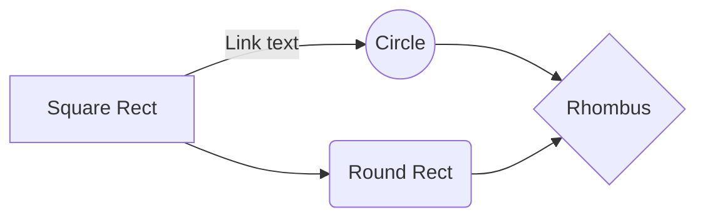

# Kafka

1. **Kafka Producer** 

   o  Do not create a new KAFKA producer for each message. Create a producer once for a session and use it multiple times. Make sure to close the producer before exiting the session or in case of a failure.

   o  Make sure the hashed value of the message key is being sent to the producer as the key. Otherwise, messages having the same key will be sent to different partitions and the transactions order might not be maintained 

   o  Close the Kafka producer – **producer.close();**

   o  Write in async mode when possible to improve performance

   ​	§ Async mode can be used only when the order of transactions is not relevant. Example: processing of a file which does not contain repeating row keys 

2. Kafka Consumer

   o  Avoid creating your own threads for Kafka consumers within the code. It is recommended to use the built-in job mechanism and Kafka interface. You can start a job instance for each partition. Examples can be found in the COE knowledge base.

   o  Perform **“commit”** every ‘X’ number of transactions. ‘X’ parameter should be tuned.
   
   
    
