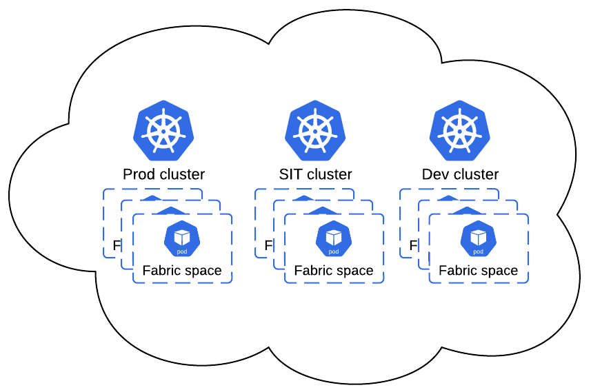
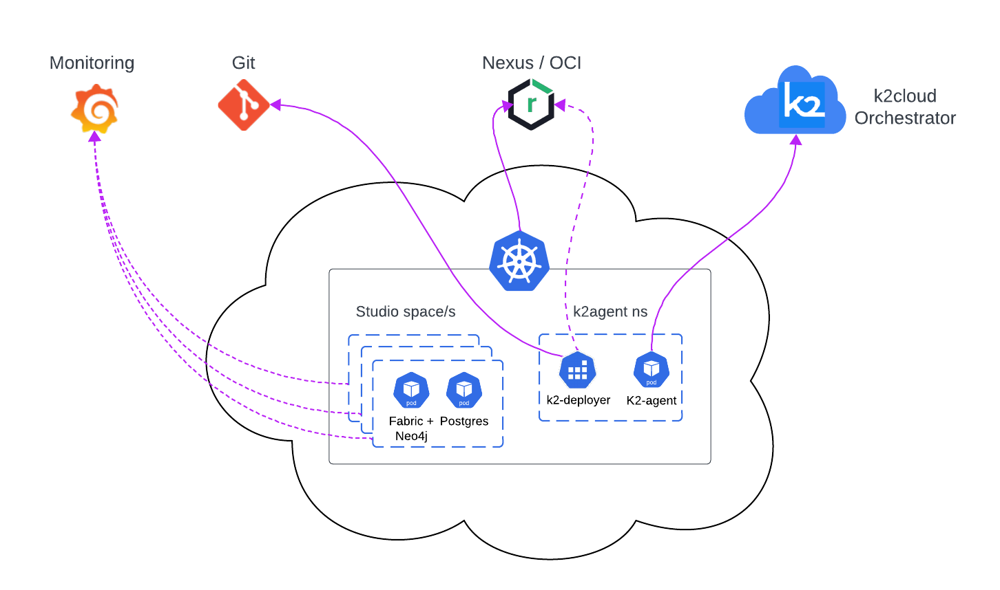

# K2Cloud Modules

The Kubernetes (k8s) and the cloud orchestrator components form the K2cloud platform, with its very high flexibility of what and where deploying spaces - the Fabric runtime environments. 

A typical customer deployment is built from 2-3 K8s clusters. Thru these deployments let's examine the K2cloud modules and their objectives. The clusters in this example are: project implementation (Dev), testing and staging (e.g. SIT) and production. 

The main reasons for such separation can be:

* performance and optimization - control better the supplied resources (CPU, RAM and persistence volume) and avoid affect of development environments on production environments. Moreover, different profiles of spaces are used for each case. For example, a Dev space are deployed with Studio, which requires its additional resources. On the other hand, a non-Dev space, like staging/pre-production or production, contains multiple Fabric nodes, which require resources. 

  Another aspect of performance is being taken,when relevant, is the locations of the data centers. Accordingly,  few clusters might be used, each on a different region. 

* Security - you can gives different permission by the K8s cluster. Each of the K8s cluster has a single outbound IP, so if for example, a specific data source shall be accessible only for production environment, then accordingly the specific K8s cluster can be whitelisted.

The K2cloud Orchestrator provides a comprehensive settings' flexibility to support these various needs.

Following are the elements and modules which are managed by the K2cloud Orchestrator, their relation and representation at the infrastructure terminology:

* **Foundation** - represents the infrastructure where the K8s cluster are deployed. For example - account at AWS, Project at GCP, Subscription at Azure or on-prem VMs.

* **Site** - represents a K8s cluster and accordingly, it is part of a foundation

* **Space Profile** - describes the profile of the space that will be created upon. For example, which Fabric image it will be used, whether Studio will be there or not, will the space be and work with Postgres, how much CPU and RAM will be applied and sort of. 

  According to each tenant's need, the relevant space profiles are associated with.

  In addition, according to consideration, space profiles are associated to the sites. For example, a studio profile might not be associated to the Prod site, and developers will not be able to create dev spaces there. Such decision is also done according to the available resources at each site.

## K2agent and Deployer

The K2agent is the element inside each K8s cluster / site which interacts with the K2cloud Orchestrator, for creating, deleting, pausing, deploying project and get status of the spaces that held inside this site. 

## External Accompany Modules

- Nexus / OCI
- Git
- Monitoring

