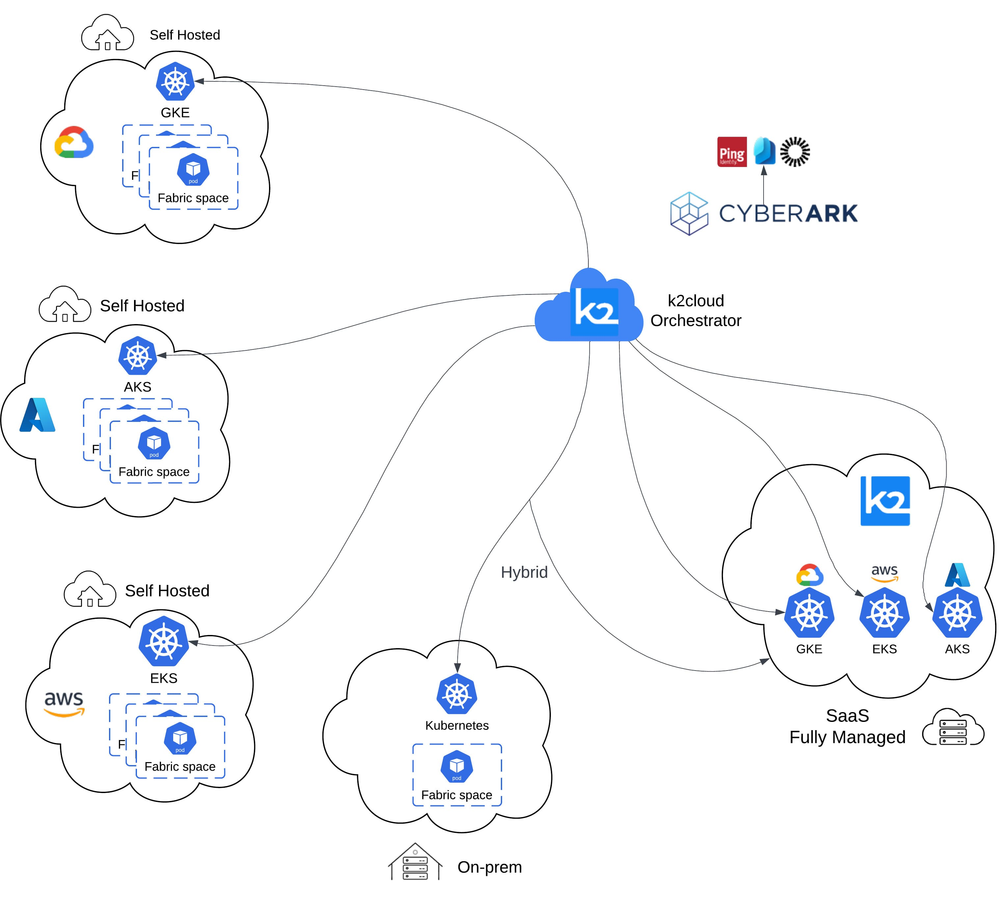

# Deployment Types

K2cloud uses a uniform methodology deployment, where the deployed infra, behavior and lifecycle are built and function the same way. This enables the flexibility of managing various types of deployment - Fully Managed (SaaS/PaaS), Self-hosted cloud tenant or Hybrid on various cloud providers (GCP, AWS, Azure).

