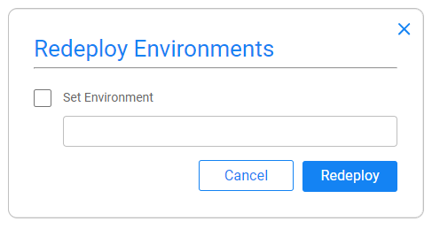
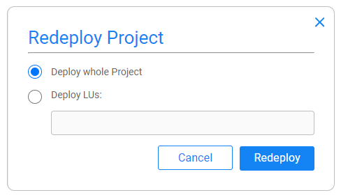

# Spaces

A **Space** is a Fabric cluster - a full working environment with all required modules and services. Through the k2cloud - also known as **k2cloud Orchestrator** - which constitutes of editable UI screens, the user is able to easily create a Space. This is done through the Spaces page, where you just need to choose what and where - the project, the profile and the location.

The Spaces page is the starting point to your daily basis work. It is reached directly by default when accessing the **k2cloud Orchestrator** on https://cloud.k2view.com/. The Spaces page displays your organization's spaces, each via its own **Space card** that provides information about the Space, showing operational mini-dashboards, and lets you take actions through it. 

## Spaces List

The Spaces page presents the list of Spaces, arranged by their creation time (newer to older), lets you to create a new space, to see spaces' status and info, as well take action upon each space.

Upon entering the **k2cloud Orchestrator**, you can see that *Show My Spaces* is selected by default in the top bar of the Spaces page; this brings about a display of only the Spaces that you have created. However, it is also possible to select *Show All Spaces*  for viewing all the Spaces created by other users.

Additionally, the Auto Refresh feature is turned on by default in the top bar as well, bringing about a display of the most up-to-date Spaces information. It can be turned on and off, and you can also click the *Refresh* button for an on-demand refresh.

  

## Space Card's Anatomy

Each **Space card** comprises of a top bar, mini dashboard metrics and in a glance information area.

### **Top Bar** 

* **Space name** - when clicked, you will leave the k2cloud and be directed to the Space itself. Clicking on the external link icon () next to the **Space name**, will lead you to the Space in another browser tab.

* **Status** - is indicated by the bar's color:

  * Blue = live and active. In this case metrics graphs are active too, and some actions are available.
  * Gray = inactive - when the Space is either paused or in a transition process - creating/pausing/resuming/deleting. In a transition process actions are not available.
  * Red = error, where a clickable information alert icon () appears in the Space's top bar. Clicking on it opens a tooltip with added error description, which can be sent to the Cloud Ops team for handling.

* **Actions** - available via the vertical ellipsis (3-dots) menu on the right side in the Space's top bar. Various actions are available, depending on the current Space's status and profile. Actions are:

  * **Redeploy Environments** - uploading a fresh Environments file into the Space, from the project in GIT, and deploying it.

    On click - a pop will appear, offering you also to change and set the global environment.

    

    Clicking on *Redeploy* will close the popup and you will see the status-change dialog box, indicating you on the deployment progress.

    > Available only for non-Studio Spaces. For a Studio Space, you shall redeploy it via Studio, to avoid misunderstanding.

  * **Redeploy Project** - update the Space with the updated project in GIT and deploy either the whole project or specified LU/s.

    On click - a pop will appear, lets you also to deploy either whole project or specific LUs.

    When *Deploy LUs* is chosen, you can type the LUs - separated by a comma.

    

    Clicking on *Redeploy* will close the popup and you will see the status-change dialog box, indicating you on the deployment progress.

    > Available only for non-Studio Spaces. For a Studio Space, you shall redeploy it via Studio, to avoid misunderstanding.

  * **Settings**

  * **Refresh Status** - trigger a refresh status action manually, either the Auto Refresh is turned on, in the top bar of the Spaces page, or not.

  * **Restart** - restart the Space, e.g., when a configuration that requires a Fabric restart is needed.

    > Available only for Studio spaces, to avoid  

  * **Pause/Resume** - either of these appear in accordance with the Space's current status (*Pause* when the Space is running and vice versa). Note that pausing your Space would save on your budget as its resource are going down. 

    > * Available only for Studio spaces, to avoid
    > * When pausing your Space you do **not** loose the changes that you may have made in your project, although you have not pushed it to GIT. Upon resuming the Space, you will have it.

  * **Delete** - delete the space, after getting your approval in the open dialog box. 

    > Available only for Studio spaces, to avoid

  * **Support**

### Mini Dashboard

The mini-dashboard provides a quick view of the Space's performance and operation. It contains 2 graphs that display data of the last 5 minutes. Wider and detailed information can be inspected in the Monitor app. - k2monitor (accessible via hamburger icon located in the top-right-corner of k2cloud Orchestrator). 

* **Reads & Writes** - to the Fabric storage. This information is important for both performance and financial aspects. In cluster mode, where there is a lot of data, the data (LUIs) is stored in cloud providers' storages that charge by read and write transactions.

  The graph is divided into 2 Y-Axes, one for read and the other for writes.

*  **API Calls** - which shows information about the calls that are done into Fabric by your platforms. The right y-axis is the Count - the number of calls, where the left y-axis shows the average response time. This gives you an at-a-glance indication of things are functional as expected.

### Card Information

The card information area is divided into 3 sections. The upper describes base info of what and where - the project, the profile and the site. The middle shows which modules are deployed and served on that space. The third section contains teh information about who created the space and when, as well as change date, for example in case it was paused or resumed.

## Create a Space

To create a new space 

1. Click on the last empty card, labeled as "Create Space" or on the top bar "Create Space" button. 
2. Define the what and where: The name of the space, the project, the profile and where it shall be created - the site. According to your deployment, each of the select list might contain one or more options.
3. Click on "Create" button.

The card it then appears at the top left of the space list, as the list is ordered by creation date, from newer to older. In addition, as long as you do not left the spaces page it is visually emphasized with a gray border.

The space creation process has 3 states - Create, Start and Ready/Error. A progress bar indicates in which state the card is currently exists. Note that even if you leave the page and get back, you will still see the state and the progress bar, for any action you make.

> space creation process might vary between project and profiles. For non Studio spaces, the space creation contains also the step of build and deploy execution, which might takes time in case the deployment also responsible to make some further automatic processes execution, defined in [deploy.flow](/articles/19_Broadway/09a_automatic_flows_execution_upon_deploy.md) or as user jobs. 
