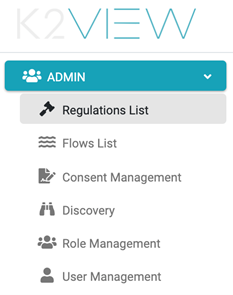

# Admin Module Overview

**Overview**

The Admin module allows the user to perform the following tasks.
- Define regulations covered by the DPM
- Create the Activities supported for each regulation 
- Create the Flows, Stages, and Tasks needed for the implementation of a customer request 
- Manage User roles
- Define customer consent topics
- Configure and execute PII Discovery
- Explore the data catalog

**Admin Menu options**

When the user logs into the DPM system as Administrator, the screen displays two windows. The left window displays a list of <b>ADMIN</b> menu options for this module. The right window displays the selected menu option. In this example, <b>Regulations List</b> is selected.

                           

From the left window, the Administrator can access the available DPM configuration options. The details for each option are described in the next chapters.

