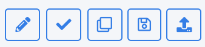

# Flow Level Actions

On the right-hand side of the Flow name are icons that respresent the available actions for that Flow. Each icon and its corresponding description are outlined in the following table. 

<table>
<tbody>
<tr>
<td width="100">

<strong>Icon</strong>

</td>
<td width="800">

<strong>Description</strong>

</td>
</tr>
<tr>
<td width="100"></td>
<td width="800">

<b>Edit this Flow</b>: Edit the Flow name and description. The Flow name and description can be updated as long as the Flow is not marked as Completed.

</td>
</tr>
<tr>
<td width="100"></td>
</td>
<td width="800">

<b>Mark as Complete</b>: When the Flow configuration is complete, use this icon to mark the Flow Completed. No further changes can be made to a flow that is marked Completed. The Flow is now available to associate with an Activity within the Activity configuration screens.

</td>
</tr>
<tr>
<td width="100"></td>
<td width="800">

<b>Duplicate this Flow</b>: Use this icon to create a new Flow version. The base of a new version begins as either a Draft clone or Completed Flow. It is created in Draft status and lets the user update Flow details in the new version.

</td>
</tr>
<tr>
<td width="100"></td>
<td width="800">

<b>Save Flow As</b>: Use this icon to create a new Flow in Draft status. The new Flow initially maintains the same details of the source Flow, but remains independent from the source.

</td>
</tr>
<tr>
<td width="100"></td>
<td width="800">

<b>Export Flow</b>: Use this icon to export the Flow to a file. This option lets the user recreate the Flow in a separate environment. For example, if a Flow was created in a testing environment, the user can import it into a production environment. Read more about exporting and importing in the <i>Export and Import Flow</i> section.

</td>
</tr>
</tbody>
</table>

At the upper-right corner of the Flow screen, the system shows general Flow information. 

 

Each information item is described in the following table. 

<table>
<tbody>
<tr>
<td width="100">

<strong>Information</strong>

</td>
<td width="800">

<strong>Description</strong>

</td>
</tr>
<tr>
<td width="100">

Version

</td>
<td width="800">

The Flow Version.

</td>
</tr>
<tr>
<td width="100">

Status

</td>
<td width="800">

The Flow Status can be Draft or Completed.

</td>
</tr>
<tr>
<td width="100">

Business Days

</td>
<td width="800">

The total Flow duration that shows the number of business days required to perform all Flow tasks. This number is based on the deadlines of the Tasks included in the Flow. The digit is rounded up to display a whole number of days.

</td>
</tr>
<tr>
<td width="100">

(x Business Hours)

</td>
<td width="800">

The total number of hours required to process the Flow, based on the combined deadline information of all related Tasks. The unit of time measurement can be configured as hours or minutes.  Note that changing the configuration from <b>Hours</b> to <b>Minutes</b> alters the expected Flow duration—not simply the units themselves. For example, a Task with a deadline configured in hours and entered as &ldquo;1&rdquo; is understood to take one hour to complete; however, when the configuration is set to minutes and entered as &ldquo;1&rdquo;, the task maintains a deadline of one minute. The <b>Minutes</b> option is typically used for testing purposes when the tester wants the Flows executed faster.

</td>
</tr>
</tbody>
</table>

