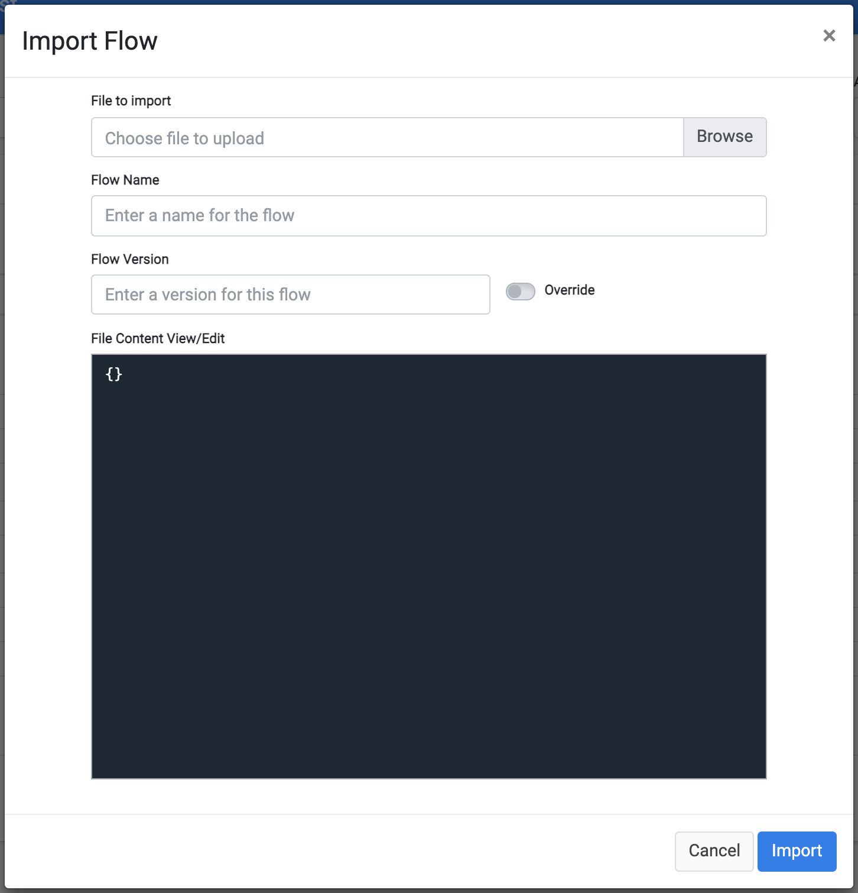
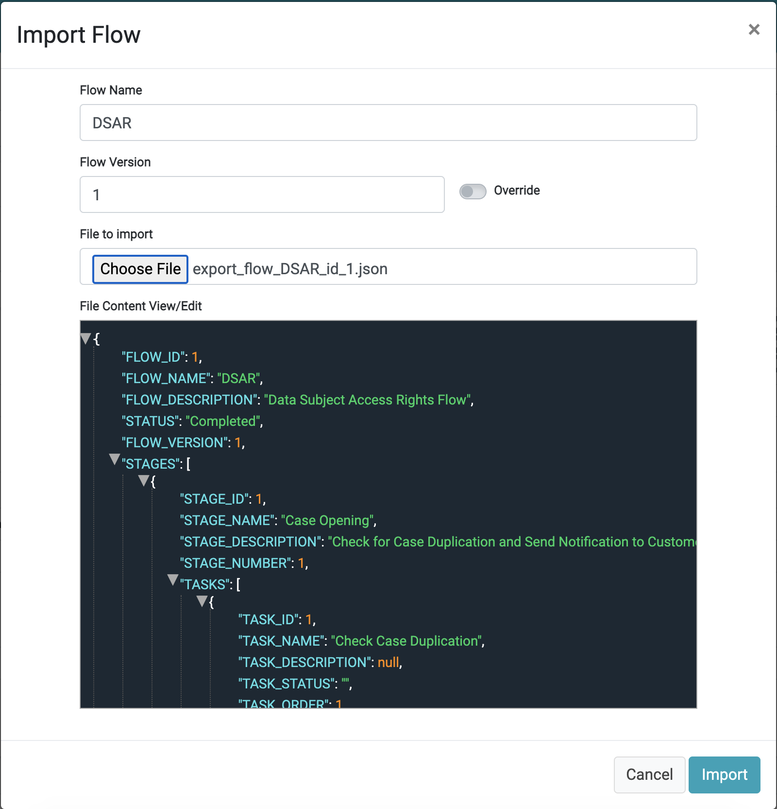

# Flow Export and Import

Flows generated within one environment can be exported and then imported into another environment. 

This functionality lets you create and test a Flow in one environment, and then effortlessly transfer it to another one. For example, you can export a Flow from an Acceptance Test environment and import it into a Production environment. 

## To Export a Flow

From the <b>Flow</b> screen, click the   icon, located on the right-hand side of the Flow name. This creates a JSON file containing the Flow configuration, which can be imported into the target environment.

## To Import a Flow

From the <b>Flows List</b> screen and within the target environment, click , located at the upper-right corner of the screen. 
A dialog box displays, defining information for the import activity. 

Select <b>Choose File</b> to select the file that contains the Flow configuration (generated as a result of the export in the previous step).
After the file is selected, the DPM loads the configuration. It identifies the Flow name and version of the imported Flow, and then displays the following information under the <b>File Content View/Edit</b> section of the dialog box.

Before confirming the import, you can change the <b>Flow Name</b> and <b>Flow Version</b>. To update the definitions of a Flow and version that already exist in the target environment, enter the same name and version as the Flow you want to update. Turn the <b>Override</b> slider to On  .

If necessary, the Flow configuration can be manually edited before clicking <b>Import</b>. You can change the content of the JSON file or edit the JSON when it displays under the <b>File Content View/Edit</b> section of the dialog box. Any editing should be done with care to prevent creating an invalid scenario or an invalid JSON structure.

