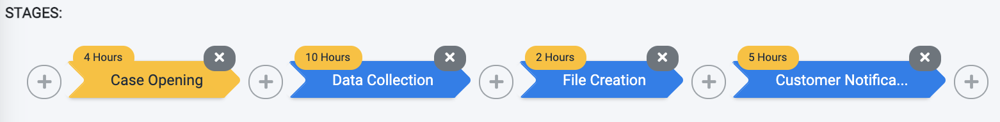
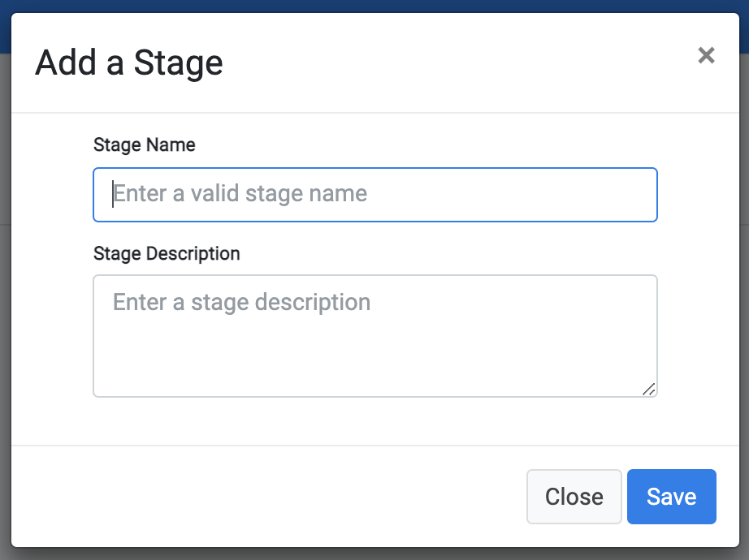

# Stages

The Stages comprising a Flow are shown in the bar below the Flow header. An example follows.  

 

- Use the + buttons to add a Stage
- Use the x buttons to delete a Stage

The duration of each Stage is marked by the yellow tag at the top of the Stage arrow. This duration is based on the SLAs of the tasks within the Stage. The duration takes into consideration the order and dependencies of the tasks included in each Stage.
The Stage name and description can be changed as long as the Flow is not marked as Completed. Edit this information by using the    button, located at the right side of the Stage header section. 

## Add a Stage

Use the <b>New Stage</b>  icon on the left side of the Flow screen to add a new Stage. The user is prompted to define a <b>Stage Name</b> and <b>Stage Description</b>, as shown in the following figure and description table.

 

<table>
<tbody>
<tr>
<td width="85">

<strong>Property</strong>

</td>
<td width="30">

<strong>M/O</strong>

</td>
<td width="785">

<strong>Description</strong>

</td>
</tr>
<tr>
<td width="85">

Stage Name

</td>
<td width="30">

M

</td>
<td width="785">

The name of this Stage.

</td>
</tr>
<tr>
<td width="85">

Stage Description

</td>
<td width="30">

O

</td>
<td width="785">

The Stage description.

</td>
</tr>
</tbody>
</table>

Save the new Stage to open the following screen and define the Stage Tasks. 

 

While the Flow's <b>Status</b> is marked as a <b>Draft</b> (not <b>Completed</b>), additional Stages can be added or updated by adding or modifying Tasks. 

