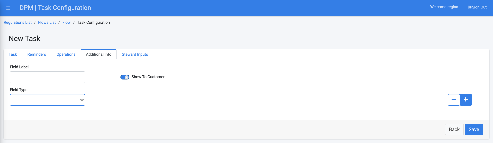
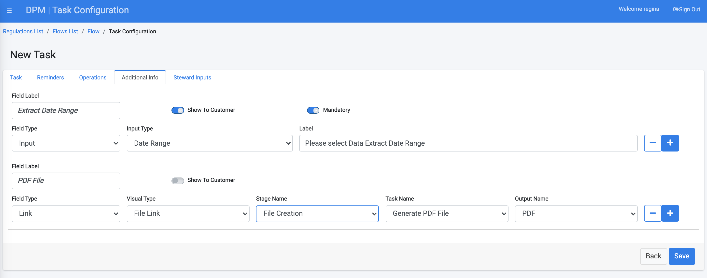
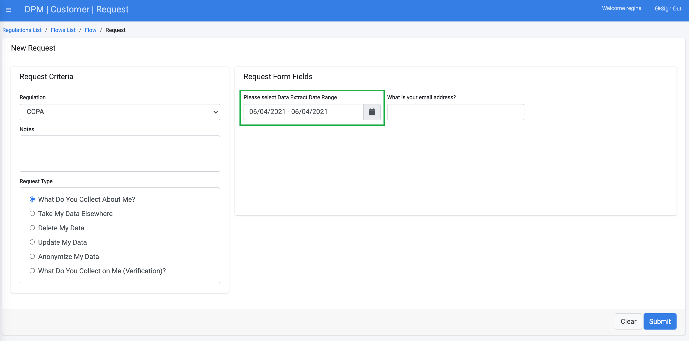
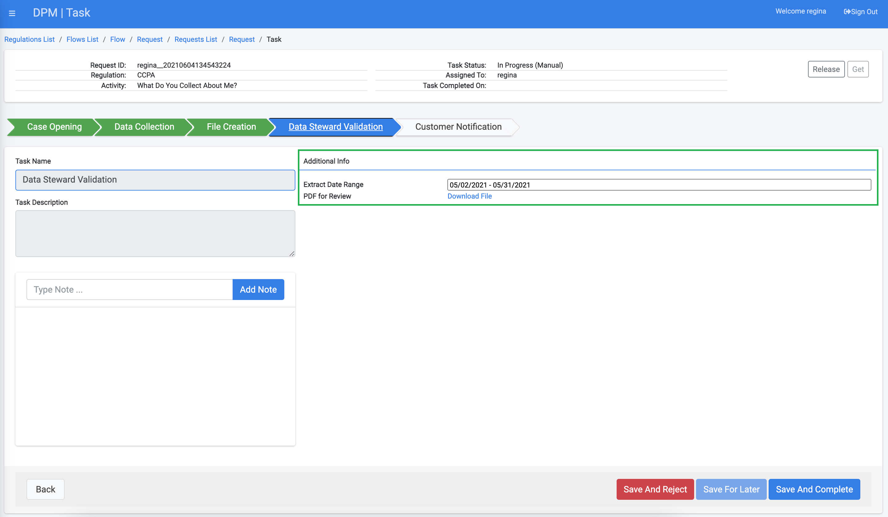

# Additional Task Information

The Additional Info tab is where you can find additional parameters that are needed to handle a task, and which are not related to an automatic operation.

The parameters that appear in this tab are shown to the data steward as part of the Task Details screen at the time of handling this task as part of the customer request fulfilment process. 

The administrator can add any number of additional info parameters, and define if those parameters should be obtained as input from the customer, or are received via link to a previous Task in the flow.  The configuration of the parameters in this tab is very similar to the configuration of parameters in the "Operations" tab, with the addition of the option to define if the parameter should be shown to the customer at the Request submission screen.  

<b>Configuring Additional Info Parameters</b>

Each additional info parameter can be defined as one of the following types:
 

- Value
- Link
- Input
  

Each of those types allows the user to define a different way to obtain information needed for the Task. The following table describes the available options.

<table>
<tbody>
<tr>
<td width="100">

<strong>Input Type</strong>

</td>
<td width="800">

<strong>Description</strong>

</td>
</tr>
<tr>
<td width="100">

Value

</td>
<td width="800">

This input option is used when the value to be used is a fixed value for the given parameter. It refers to a known value at the time of the Task configuration and does not depend on the customer that makes the request.

The value should be specified in the &ldquo;value&rdquo; field that the system presents to the user when this option is selected.

</td>
</tr>
<tr>
<td width="100">

Link

</td>
<td width="800">

This option enables the use of a value determined as a result of the execution of a previous Task. The previous Task can be derived from the same Stage of the current Task or from any of the previous Stages of the Flow. When selecting this option, the system enables the user to define the Stage, Task and Task output to be used.

</td>
</tr>
<tr>
<td width="100">

Input

</td>
<td width="800">

Use the &ldquo;input&rdquo; option when the Task requires a specific input from the user at the moment of opening a new DPM Request.

The system requires the user to define the type of the input field (e.g. text, email, custom list etc.) and the label of the field that the user will be requested to fill. 

When a new DPM Request is submitted by a representative or customer, the system will present to the user the list of parameters that were defined as “input” and the label defined here appears as the label of the field that should be populated. 

For example, when the input parameter is the email address of the customer, the label can be defined to be “email address” or “Please provide your email address”.

</td>
</tr>
</tbody>
</table>

The following example demonstrate how the "additional info" can be used as part of a DSAR flow:

   We defined that as a part of a DSAR flow, a data steward should review the file that was generated by the data extraction operation, and confirm that the date range requested by the customer was correctly covered. 

   To achieve that, the administrator added a manual task as part of the DSAR flow, and in the "additional info" tab, defined two parameters:

   - Extract Date Range - an input from the customer, marked as "Show to customer" and as "mandatory". 
   - PDF File - defined as Link, and is configured to present to the data steward the PDF file that was generated as part of the DSAR request, before it is sent to the customer.

   At the "Task" tab of this task (first tab) we marked this as "Steward can reject Task", so that if the PDF was not generated correctly, the data steward can reject the task so that the issues identified in the file can be corrected.

As a result of the task configuration described above, when a customer submits a request that includes this task, the Extract Data Range appears as an input field, as demonstrated below (the second field in this image, requesting for the email address, originates from the inputs defined in other task in the same flow):  

   

Once the request fulfillment flow reaches the task we have configured above, the steward who handles this task can view the date range requested by this customer, and can open the PDF that was generated for this customer in previous tasks:

