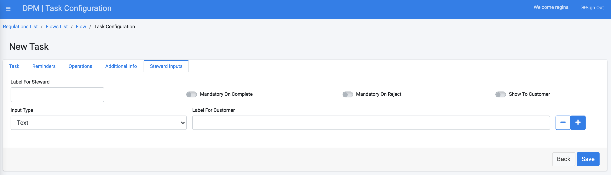
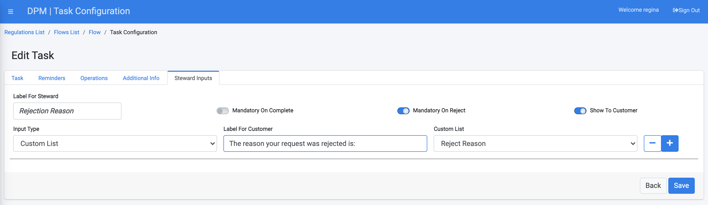
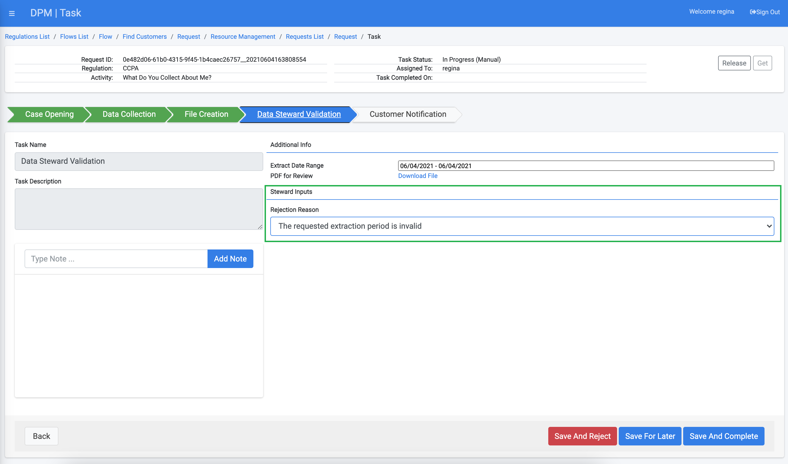
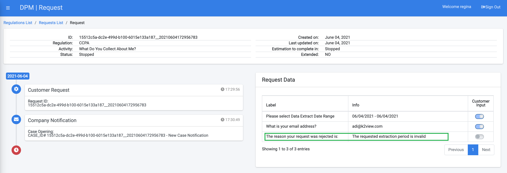

# Steward Inputs

The Steward Inputs tab is used to define the input parameters that a data steward should populate when performing a Task manually.

Parameters that are configured in this tab appear to the data steward in the Task Details screen, and the data steward must fill them before concluding or rejecting the Task.

<b>Configuring Steward Input Parameters</b>

For each steward input parameter configured in this tab, the following parameters can be defined:
 

- **Label for Steward** - Descriptive text for this input parameter. 
- **Mandatory on Complete** - Switching this attribute "on" means that the population of this information is mandatory when the data steward handles the Task and wants to mark it as "Complete".
- **Mandatory On Reject** - Switching this attribute "on" means that the population of this information is mandatory when the data steward handles the Task and wants to mark it as "Rejected".
- **Show to Customer** - When this attribute is switched "on", the input provided by the data steward will be presented to the customer at the Request Details screen. The label that the customer sees is the text that is populated in the "Label For Customer" field.
- **Input Type** - Text or Custom List.   
  

The following example demonstrates how the "Steward Inputs" can be used as part of a DSAR flow:

We define that as a part of a DSAR flow, a data steward should specify a rejection reason before rejecting a task.  

Using the same task we configured in the previous "Additional Info" section, the administrator has added an entry in the "Steward Inputs" tab, which requires the data steward to provide a rejection reason before rejecting the task.

As shown in the image above, the new input is set with both "Mandatory On Reject" as well as "Show To Customer" switched "on".

The Input type was set to "Custom List", and the list that is used is called "Reject Reason". The result of this configuration is that when the data steward opens the Task to handle it, the field "Rejection Reason" is presented as a dropdown and allows the selection of one of the pre-configured rejection reasons that are defined in this custom list. 

We also configured in the "Task" tab of this task (first tab), that the "Steward can reject Task" and "Reject stops case", so that if the steward rejected the task, the whole request is stopped.

As a result of the task configuration described above, when a customer submits a request that includes this task, when the steward handles this task the Reject Reason is presented, and is mandatory if the task is to be rejected:  

If the steward rejected the Task, the whole Request is stopped as a result, and the rejection reason appears to the customer at the Request Details screen:

