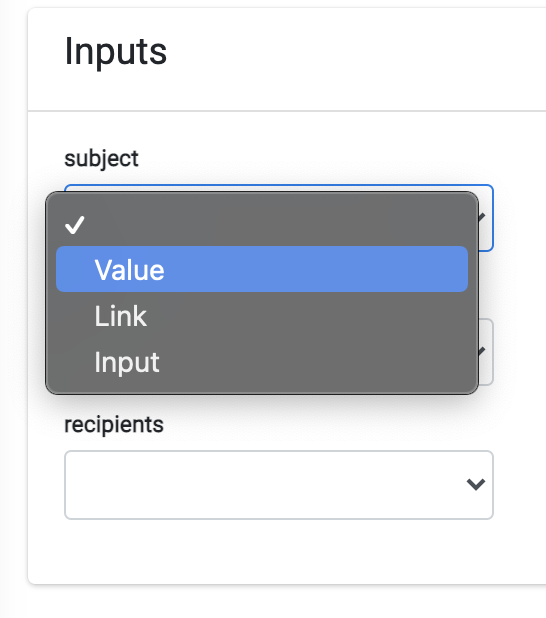

# Operations

The Operations tab allows the Admin to add an automated Activity to be executed to perform the Task. 

The user selects an Operation from the operation dropdown list. As a result, the list of parameters to be defined for the selected Operation is dynamically presented in the “inputs” section of the tab. Some operations may not need any parameters. 

As an example, for a Task that should execute the Operation “SendMail” the system expects the parameters “Message”, “Subject” and “to” as configured items. 

 

<b>Configuring Parameters for an Operation</b>

When an operation requires the configuration of one or more parameters, the value of those parameters can be defined in several different ways. Each parameter can be one of the following types:
 

- Value
- Link
- Input

Each of those types allows the user to define a different way to obtain information needed for the execution of the operation. The following table describes the available options.

<table>
<tbody>
<tr>
<td width="100">

<strong>Input Type</strong>

</td>
<td width="800">

<strong>Description</strong>

</td>
</tr>
<tr>
<td width="100">

Value

</td>
<td width="800">

This input option is used when the value to be used is a fixed value for the given operation. It refers to a known value at the time of the Task configuration and does not depend on the customer that makes the request.

The value should be specified in the &ldquo;value&rdquo; field that the system presents to the user when this option is selected.

</td>
</tr>
<tr>
<td width="100">

Link

</td>
<td width="800">

This option enables the use of a value determined as a result of the execution of a previous Task. The previous Task can be derived from the same Stage of the current Task or from any of the previous Stages of the Flow. When selecting this option, the system enables the user to define the Stage, Task and Task output to be used.

</td>
</tr>
<tr>
<td width="100">

Input

</td>
<td width="800">

Use the &ldquo;input&rdquo; option when the Task requires a specific input from the user at the moment of opening a new DPM Request.

The system requires the user to define the type of the input field (e.g. text, email, custom list etc.) and the label of the field that the user will be requested to fill. 

When a new DPM Request is submitted by a representative or customer, the system will present to the user the list of parameters that were defined as “input” and the label defined here appears as the label of the field that should be populated. 

For example, when the input parameter is the email address of the customer, the label can be defined to be “email address” or “Please provide your email address”.

</td>
</tr>
</tbody>
</table>

The following image demonstrates the information the DPM requests the Administrator to fill for each input option. 

 

In this example of an operation that sends a DSAR response emails to customers, six input parameters are required: Customer ID, E-mail type (the template of the e-mail to be used in the communication to the customer), the file name, the PDF file itself, the recipient of the e-mail and the e-mail subject. Observe in the image how the different type of input fields are defined. For example:  

- The field “PDF” was defined as “Link”, as it should get as an input the PDF file that was generated in previous task of thi sflow. As a result the system presents to the administrator the fields Stage Name, Task Name and Output Name. The administrator can define from which previous Task the information for this field is to be received. 
- The field “Recipients” was defined as “input”, meaning the customer will be requested to provide this value at the moment of submitting a request. The system presents to the administrator the field "input type" to define the nature of the input value (e-mail in this case), and the field “Label”, which defines the text that will be presented to the customer so he will know to provide the recipient email address.
- The field "Subject” was defined as “Value”, meaning the administrator can define a fixed text that will be presented as the subject of the mail. The system presents to the administrator the field where the text should be written.

