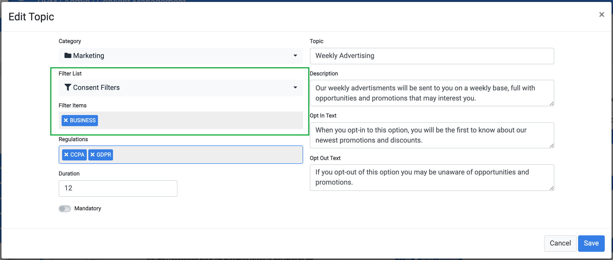

## Custom Lists In Consent Configuration

Another use of the Custom List is for the creation of filters in the consent configuration. 

Each consent can be associated with a set of filters so that this consent would be presented only for customers that meet the filter criteria. 

As an example, if there is a distinction between the consents that should be presented for a business account and those that should be presented for a consumer account, a custom list with those two values can be created, and associated with the relevant consents. 

The association between consent and the custom list is made in the New/Edit Consent configuration page: 

When a data subject, such as a customer, opens the Consent list page, the list of consent that is presented only includes those that this customer meets their filter criteria. 

Thanks to the ability to integrate between the DPM and any corporate source system, determining if a customer meets the filter criteria is made at the level of the project implementation and can be based on any of the customer data.

[
 Return to main menu
](/articles/DPM/README.md)