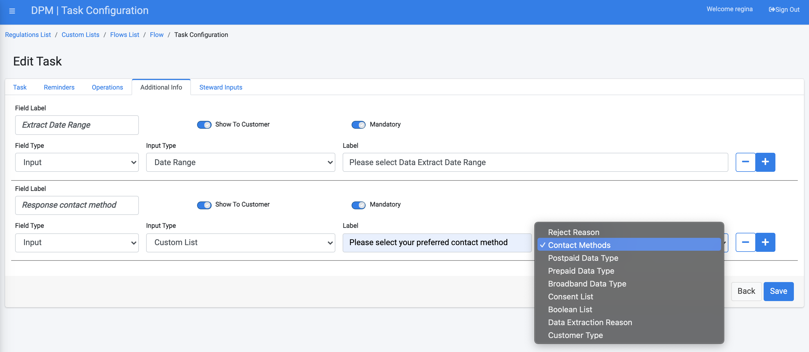
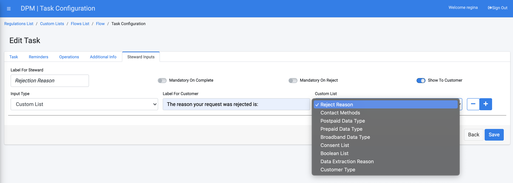
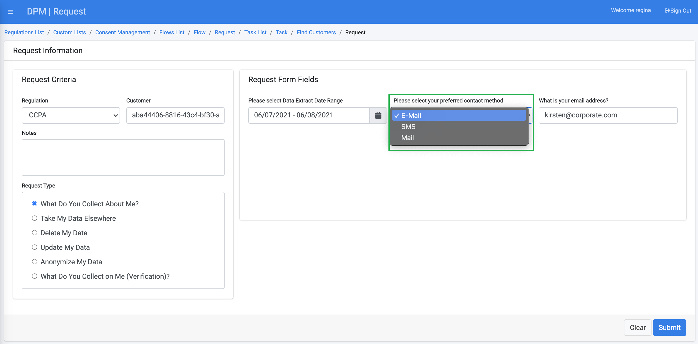
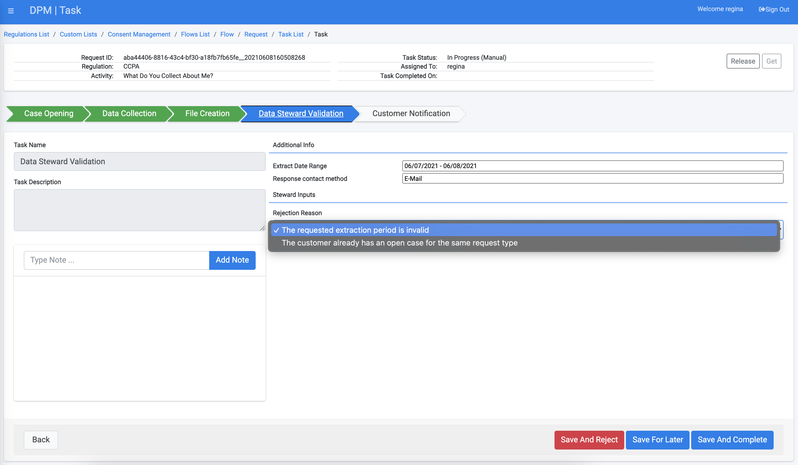

## Custom Lists In Flows Configuration

Use the custom list when configuring Data Subject Requests (DSR) Flow parameters that should be presented to the DPM user as a list of options to chose from.

This configuration can be done in any of the tabs which permit definition of input parameters in the Tasks configuration: 

- **Operations** - when a dropdown is required when collecting customer input for automatic tasks 
- **Additional Info** - when a dropdown is required when collecting customer input for manual tasks 
- **Steward Inputs** - when a dropdown is required when a task is being handled by a data steward

To configure the custom list, In any of the abovementioned Task tabs, chose the "Custom List" field type when defining the type of an input field, as in the following example:

As a result, the DPM enables you to select what is the custom list that should be used and define what is the label that should be presented to the user.

In the example below we have configured a Task to use Custom List in two places -  Additional Info and Steward Inputs:

- **Additional Info:** To allow the customer define a preferred contact method as part of the inputs in the Additional Info tab:

   

- **Steward Inputs:** To allow the data steward to specify the Request rejection reason when handling a request:

The results of the two configurations above is that when a customer submits a Request that uses this Flow, the Contact method will appear as a dropdown in the Request submission screen:

In addition, when the data steward handles the Task as part as the Request fulfillment, the information that was selected by the customer appears in the Additional Info section, and the option to select a rejection reason appears at the Steward Inputs section, as shown below:

 

