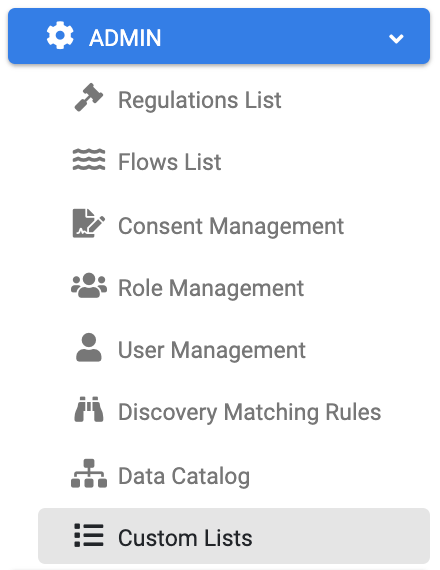
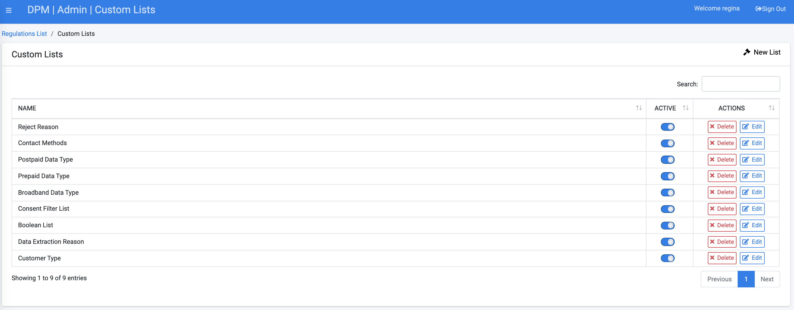
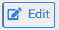
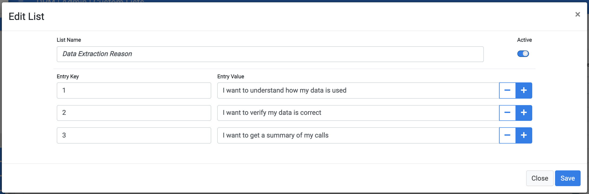
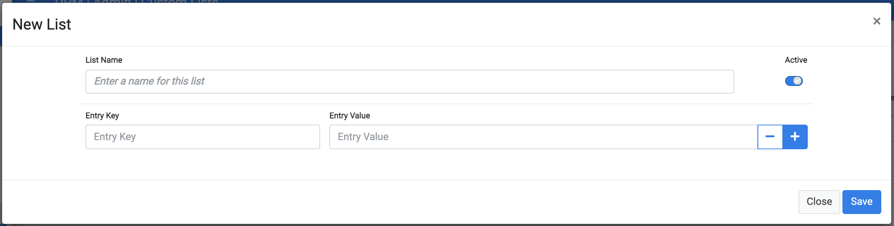

# Custom Lists

Use Custom lists when you want to present a list of predetermined values, so that the user can choose between the options.  with custom lists, the set of values that is presented to the end user is configurable and can be changed at any point of time. 

Custom lists can be used wherever an input is needed from customers or stewards, as described in the following examples: 

Let's assume that when submitting a DSAR,  the customer should choose the contact method that should be used for the reply. The values that should be presented to the customer in the dropdown of options can be defined as custom list and this custom list associated with this specific input field in the task configuration. The values are thus automatically presented to the customers when submitting a DSAR.  

Another example for the use of custom list is if you have a task that requires a data steward to validate the customer request before data is collected. If the steward had determined that the request is invalid, then the rejection reason should be specified. To attend this requirement, define the rejection list as a Custom List and associate to an input field in the Task's "Steward Inputs" tab.

### Custom List Configuration

Select the option of Custom Lists from the Administrator menu in order to access the custom list functionality: 

The system presents the list of options which were already configured. For example: 

You can enable or disable each list by switching on or off the Active  control. 

To view or edit any of the lists, click the list line or use the button. That would open the list details screen:

The values that are configured for this lists are presented. The Entry Key is the identifier of the entry for the DPM system and the Entry Value is the text that is presented to the end user in the dropdown. 

In this screen you can: 

- Update the list name.
- Update the key or value of each entry.
- Enable or disable the list by using the Active  control.
- Add or remove entries from the table by using the  control.

Use the  to delete a list. The DPM will prevent you from deleting a list that is being used by a task or as consent filter.

### Create New List

Use the  button on the upper-right corner in order to define a new list:

In this screen you can: 

- Define the list name.
- Enable or disable the list by using the Active  control.
- Add or remove entries from the table by using the  control. For each entry, the Entry Key and Entry value should be defined.

Use the  button to save the new list.

The following sections in this guide demonstrate how custom lists are used across the DPM application. 

