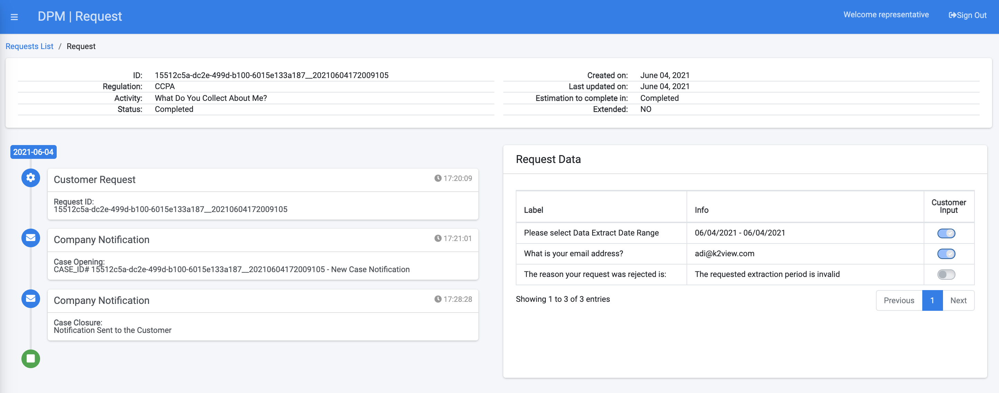
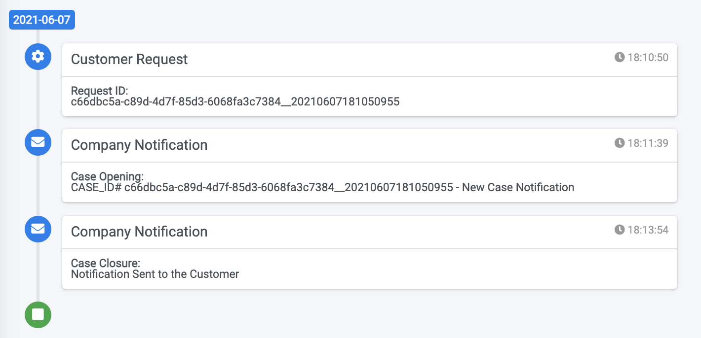
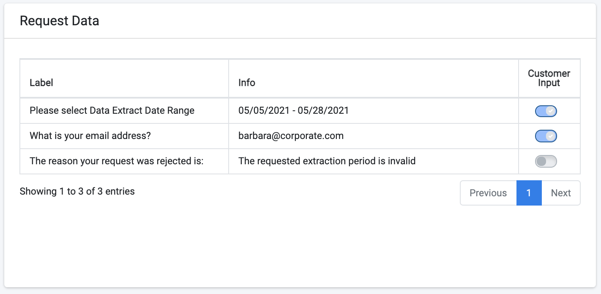

# Request Details

Once the search results are presented, the representative can view further details of a specific request by clicking the row of this request, as shown in the next image.

The top section of the screen includes the high level request information: 

<table>
<tbody>
<tr>
<td width="200">

<strong>Field</strong>

</td>
<td width="700">

<strong>Description</strong>

</td>
</tr>
<tr>
<td width="200">

Request ID

</td>
<td width="700">

The unique identification of the request.

</td>
</tr>
<tr>
<td width="200">

Regulation name

</td>
<td width="700">

The Regulation for which the request was created.

</td>
</tr>
<tr>
<td width="200">

Activity name

</td>
<td width="700">

The Activity this Request executes.

</td>
</tr>
<tr>
<td width="200">

Request Status

</td>
<td width="700">

The Request status.

</td>
</tr>
<tr>
<td width="200">

Created on

</td>
<td width="700">

The date and time the Request was submitted.

</td>
</tr>
<tr>
<td width="200">

Last Update Date

</td>
<td width="700">

The last time this request was updated. The Request is updated as its execution is progressing; this date indicates the last date that a Task was executed in the Flow fulfilling this Request.

</td>
</tr>
<tr>
<td width="200">

Estimated completion

</td>
<td width="700">

The number of days the request is expected to complete. The number of days calculation is based on the Request creation date and the Activity SLA.

</td>
</tr>
<tr>
<td width="200">

Extended

</td>
<td width="700">

Indicates if the Request SLA was extended. The values are true/false

</td>
</tr>
<tr>
<td width="200">

Extendable

</td>
<td width="700">

Indicates if the Request SLA can be extended. This depends on the configuration of the Activity of this task.

</td>
</tr>
</tbody>
</table>

## Request Timeline

The section that appears below the header, on the left side of the screen provides the main milestones of the request:

 

The timeline presents information such the date the request was submitted, the dates when notifications were sent to the customer, and the date when the request was completed.

## Request Data

The section to the right of the screen shows detailed data originating from the request input and output attributes. 

The information in this section includes the the inputs that were requested from the customer at the moment of the request submission, as well as information that was generated as part of the request fulfilment process and that were marked as "show to customer" at the Task configuration screen. 

<table>
<tbody>
<tr>
<td width="200">

<strong>Field</strong>

</td>
<td width="700">

<strong>Description</strong>

</td>
</tr>
<tr>
<td width="200">

Label

</td>
<td width="700">

The Label that was defined for this attribute in the Task configuration.

The labels are defined in the Tabs "Operations", "Additional Info" and "Steward Input" of the Task configuraiton.

</td>
</tr>
<tr>
<td width="200">

Info

</td>
<td width="700">

The actual content of the attribute as was provided by the customer or generated as part of the reqeust fulfilment process.

</td>
</tr>
<tr>
<td width="200">

Customer Input

</td>
<td width="700">

Set to "on" if the information was provided by the customer, and "off" if it was generated as part of the request fulfilment process.

</td>
</tr>
<tr>
</tbody>
</table>

More details about the way to configure parameters so that they would appear on the Request Data section can be found in the [Task Configuration](/articles/DPM/02_Admin_Module/05_Tasks.md) section of the Administrator user guide. 

