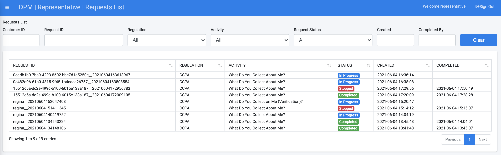

# Requests List

Search a request from the Representative menu by selecting the “Requests List” menu option. The displayed screen includes the list of existing requests and allows searching for a specific request based on multiple parameters.

<table>
<tbody>
<tr>
<td width="100">

<strong>Column</strong>

</td>
<td width="800">

<strong>Description</strong>

</td>
</tr>
<tr>
<td width="100">

Request ID

</td>
<td width="800">

The unique identification of the request.

</td>
</tr>
<tr>
<td width="100">

Regulation

</td>
<td width="800">

The Regulation for which this request was created.

</td>
</tr>
<tr>
<td width="100">

Activity

</td>
<td width="800">

The Activity this Request executes. 

</td>
</tr>
<tr>
<td width="100">

Status

</td>
<td width="800">

The Request status. Values may be: In Progress, Completed, Stopped. A Stopped Request is a Request,  during its execution the system identified the request should stop its execution. For example, if there is a validation, the same customer cannot open two equal Requests, and there is already an in-progress Request for this same customer and Activity. 

</td>
</tr>
<tr>
<td width="100">

Created

</td>
<td width="800">

The date and time that the Request was submitted.

</td>
</tr>
<tr>
<td width="100">

Completed

</td>
<td width="800">

The date and time that the Request was completed (completed requests only).

</td>
</tr>
</tbody>
</table>

For the search criteria selected by a drop-down list or by selecting a date: Regulation, Activity, Request Status, Created and Completed – the search is executed upon a value selected.  

For the search criteria entry fields: Customer ID and Request ID, typing in either the customer ID and Request ID fields, the search is invoked upon the first three stated characters or more.  Once the search results are presented, the representative can view further details of a specific request by clicking the row of this request, as shown in the next image.

