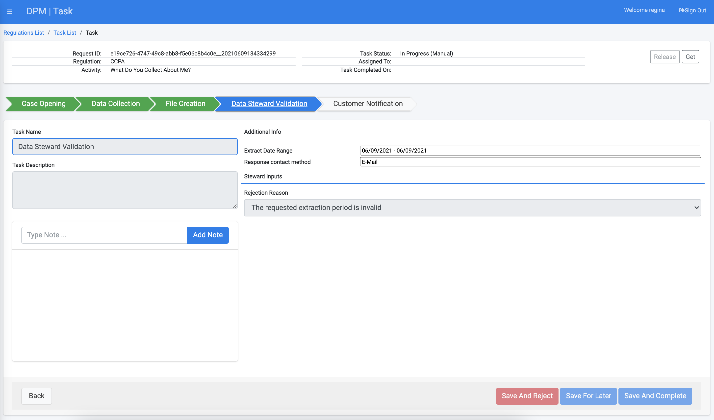
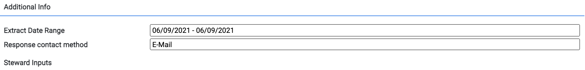
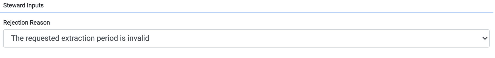
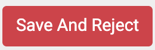
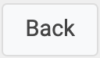

# Task Details

The Task Details screen provides the Steward a view of the task details, from which notes can be added or the task can be marked “Complete”.  

If the Task is unassigned, the Data Steward can also use the “Get” button on the top of the screen to take ownership on the Task.  

### Task Header

The upper section of the screen, as well as the left lower section provide high level information about the task:

<table>
<tbody>
<tr>
<td width="100">

<strong>Field</strong>

</td>
<td width="800">

<strong>Description</strong>

</td>
</tr>
<tr>
<td width="100">

Request ID

</td>
<td width="800">

The unique identification of the request.

</td>
</tr>
<tr>
<td width="100">

Regulation

</td>
<td width="800">

The Regulation for which this request was created.

</td>
</tr>
<tr>
<td width="100">

Activity

</td>
<td width="800">

The Activity that this Request executes.

</td>
</tr>
<tr>
<td width="100">

Task Status

</td>
<td width="800">

The Task status.

</td>
</tr>
<tr>
<td width="100">

Assigned To

</td>
<td width="800">

Indicates the user assigned to this Task. Filled only for assigned Tasks.

</td>
</tr>
<tr>
<td width="100">

Task Completed On

</td>
<td width="800">

The date and time the Task was completed. Filled only for a Task that was already completed.

</td>
</tr>
<tr>
<td width="100">

Task Name

</td>
<td width="800">

The name of this Task.

</td>
</tr>
<tr>
<td width="100">

Task Description

</td>
<td width="800">

The Description of the Task.

</td>
</tr>
</tbody>
</table>
The section at the right-lower part of the screen provides details that are specific for the task input and output parameters, and is divided to two parts: "additional info" and "Steward inputs".

#### Additional Info

Additional Info provides the data steward with information that is required in order to perform this task. The information that appears in this section depends on the configuration that was made in the Task "Additional Info" tab, and may include input obtained from the customer at the request submission, information collected or generated by the DPM system such as a file containing the customer data and more. 

 

#### Steward Info

The steward info section contains fields that the data steward should fill as part of the handling of this task. Similarly to the "Additional Info" section, the list of fields that appear in this section is dynamic, and is configurable in the Task Steward Input" tab. Example for information that may be collected is request rejection reason, or complementing fields which are not collected automatically. 

In accordance with the way this task was configured by the administrator, the fields in this section may be optional, or mandatory. It may be that a mandatory field is defined as mandatory only in order to mark the Task as "Complete", or only if the user wishes to mark the Task as "Rejected".

#### Actions in the Task screen

The actions available from this screen include: 

- Add a Note - The Steward and Case Owner can each add notes to a Task.  To add a note, type text in the text box next to the button, then click “Add Note” to submit it. The notes appear chronologically at the text box, just below the “Add Note” line.
- Get or Release a Task – use the     buttons to either “Get” a Task or “Release a Task. Getting a Task is enabled only when this Task is not yet assigned to another user. Releasing a Task is only enabled when the Task is assigned to the user currently viewing the screen. Both buttons are disabled when the Task is not to be executed (for example, the Task was already completed, waived or not yet ready for execution, since the Flow had not reached the point of execution) .
- Mark a Task as Complete – if the  Task is assigned to this user, the updates to the Task information can be saved and the Task marked as Complete using the  button. Naturally, a Task should be marked as complete after the user had performed the expected action for this Task. 
- Save and Reject - Some Tasks allow the data steward to reject the task instead of completing it. For example, if the task purpose is to validate the user identity and the validation result came out as negative. Use the button for this purpose. This button is enabled only if the Task configuration at the Task configuration first tab was set to allow that it can be rejected. 
- Save For Later - Use the  if updates were made to the Task information, but you are not yet ready to mark it as complete or rejected.
- Back to previous screen– the button   button closes the Task screen and returns to the Task List screen.

For more information about task configuration and how it impacts the Steward Task screen -  please refer to the administrator [Task Configuration](/articles/DPM/02_Admin_Module/05_Tasks.md) section of this user guide. 

Information about the Flow of the Request is provided to the user through the progress bar. An example of the progress bar follows: 

 

The progress bar displays the Flow Stage; several stages are represented by the same fill color; Completed Stage appears in green, a Processing Stage appears in blue, and an Overdue Stage appears in red.  
For the preceding example, the Stage of “Case Opening” appears in green, denoting completed. The stage “Data Collection” appears in blue, denoting it is the stage currently in progress. The Stages in gray are those not yet started.

