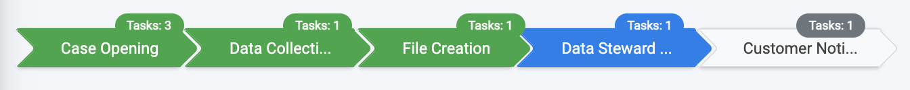

# Request Details

From the Requests List screen, the case owner selects the row of a particular Request to open the corresponding Request Details Screen

 

The Case Owner reviews all request details. 

The upper part of the screen displays general information about the Request; heading information and Request stages, respectively.

 

Under the header section, the different stages that make part of the Request process are presented: 

 

Completed Stages are shown in green. The current Stage is presented in blue when on track towards completion. When the Stage is not on track, it is shown in red signifying past due. Future Stages to be processed appear in grey. 

The number of Tasks in the Stage is displayed on top of every stage. If a Stage includes an overdue Task, then the Tasks count is shown in red.

The Case Owner can navigate between the stages by clicking on the Stage section in the presented chart. Navigating to a particular stage presents only those tasks made a part of the Stage. The view of all Tasks can be restored by selecting the “Show Tasks for All Stages” button. 

At the bottom of the screen, the list of Tasks is presented:

 

<table>
<tbody>
<tr>
<td width="100">

<strong>Field</strong>

</td>
<td width="800">

<strong>Description</strong>

</td>
</tr>
<tr>
<td width="100">

Task Name

</td>
<td width="800">

The name of the Task.

</td>
</tr>
<tr>
<td width="100">

Stage

</td>
<td width="800">

The Stage for which this Task belongs.

</td>
</tr>
<tr>
<td width="100">

Order

</td>
<td width="800">

The order of this Task within its Stage (details about the Task order are described in the Flow section).

</td>
</tr>
<tr>
<td width="100">

Role

</td>
<td width="800">

The Corporate Role defined as the owner of this Task to execute it.

</td>
</tr>
<tr>
<td width="100">

Assignee

</td>
<td width="800">

The user responsible to execute the Task. This field is populated when a user takes ownership of a Task by selecting the “Get” button from the Task details screen

</td>
</tr>
<tr>
<td width="100">

Task Status

</td>
<td width="800">

The current status for the Task (i.e., processing, stopped, completed).

</td>
</tr>
<tr>
<td width="100">

Duration

</td>
<td width="800">

The duration of time this Task is expected to complete. The unit of time expressed is configured (hours, minutes). Hours is the most common configuration.

</td>
</tr>
<tr>
<td width="100">

Start Date

</td>
<td width="800">

The date and time the Task execution began. This field is populated for Tasks already in the execution phase.

</td>
</tr>
<tr>
<td width="100">

Due Date

</td>
<td width="800">

The date and time the Task was completed. Filled only for a Task already completed.

</td>
</tr>
<tr>
<td width="100">

Notes

</td>
<td width="800">

This field indicates if notes were submitted for this Task.

</td>
</tr>
</tbody>
</table>

The Case Owner can select a specific Task to view its details.

