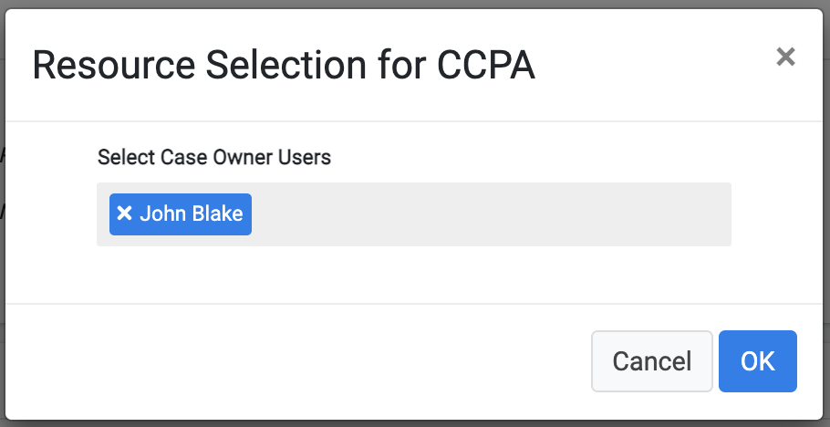
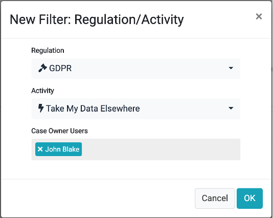

# Assignment Criteria 

The Assignment Criteria is defined in the lower section of the Resource Management screen:

 

The assignment criteria provide the ability to define who are the Case Owners that are responsible for a specific Regulation or for a specific Activity under this Regulation. 
If the option selected is  , then no special criteria should be used, and the system follows the assignment method that was selected in the upper section of the screen (see previous topic).

To activate the option to define Case Owners per Regulation, select the option , to display the list of active regulations in the DPM system, and allow the user to allocate a regulation to one or more Case Owners. In the example above, CCPA Requests are allocated only to the Case Owner called “John Blake”, the GDPR Requests are allocated to either “John Blake” or “Linda Pie”, and LGPD Requests are allocated to any Case Owner (value ALL). 

To define the users allocated to each Regulation, select the line of the Regulation to be configured. A pop-up screen allows selection of one or more Case Owner users. 

The next level of assignment criteria is the . When this option is switched on, the supervisor can define additional assignment criteria at the Activity level. In the example below, every Request of the Regulation CCPA and Activity “Take my Data Elsewhere” will be allocated to the Case Owner user called “John Blake”. 

To add new assignment criteria at the Activity level, use the   option at the right side of the screen. This opens a pop-up screen where the supervisor can select the Regulation, Activity and one or more Case Owners that should be responsible for the Requests of this type. 

