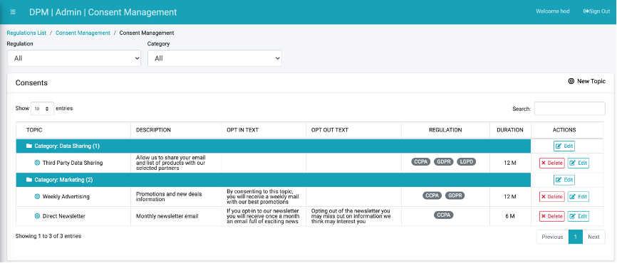
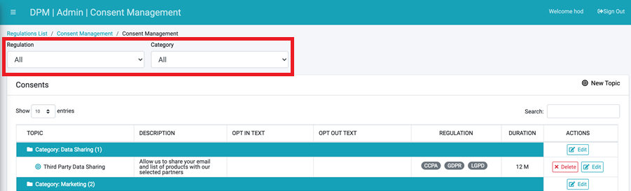

# View Configured Consents List

To view the list of configured consents or to create new ones, access the Consent Management option at the DPM Administrator module.

The Consent Management screen displays the consent topics that were already configured by the Administrator, and allows adding a new consent or altering an existing consent configuration. 

Filter options display along the top-left of the screen, letting you clarify the list of consents presented by <b>Regulation</b> and/or <b>Category</b>.

 

To search a specific consent, use the Search option at the top-right of the Consents table. 

The following defines each column within the Consents table.

<table>
<tbody>
<tr>
<td width="103">

<strong>Field</strong>

</td>
<td valign="top" width="700">

<strong>Description</strong>

</td>
</tr>
<tr>
<td valign="top" width="103">

TOPIC

</td>
<td valign="top" width="700">

The consent topic name.

</td>
</tr>
<tr>
<td valign="top" width="103">

DESCRIPTION

</td>
<td valign="top" width="700">

The consent topic description.

</td>
</tr>
<tr>
<td valign="top" width="103">

DURATION

</td>
<td valign="top" width="700">

The duration that the consent is considered valid at the customer level. For every customer, the consent takes effect the moment of opting-in, and then for the duration that is specified in this field.

</td>
</tr>
<tr>
<td valign="top" width="103">

REGULATION

</td>
<td valign="top" width="700">

The list of regulations linked to a consent. This allows control of the list of consents presented to each customer in accordance with the relevant regulation.

</td>
</tr>
<tr>
<td valign="top" width="103">

FILTER

</td>
<td width="700">

When the consent topic is associated with filters, then this consent would only be presented to customers that meet the filter criteria

</td>
</tr>
<tr>
<td valign="top" width="103">

MANDATORY

</td>
<td valign="top" width="700">

If a consent topic is defined as mandatory, it means that the consent would be presented to the customer as "on" and the customer cannot opt-out from this consent.

</td>
</tr>
<tr>
<td width="103">

ACTION

</td>
<td width="700">

Click the <strong>Edit</strong> button to change the details for this consent topic, or click the <strong>Delete</strong> button to remove it.

</td>
</tr>
</tbody>
</table>

## Consent Categories

Consents are grouped under user-defined Categories for better organization. Categories are defined by the Administrator when creating a new consent, as described in <i>8.2.2 Create New Consent Topic</i>. The Category name can be altered by clicking its respective <b>Edit</b> button under the <b>ACTIONS</b> column.

 

