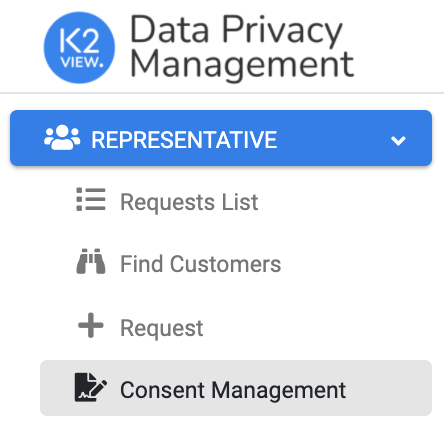

# Representative Consent Management on Customer's Behalf

The DPM interfaces for representatives and agents are similar to the screens and APIs for the customer, described in 8.3.1 Customer Facing Interface. DPM includes both a Web-based user interface and an API set to allow a Customer Service Representative (CSR) or an agent perform the same consent management activities as the customer. Activities include viewing the consent preferences of an end-user, as well as submitting a change to the consent preferences on behalf of the end-user.

The CSR can set consent preferences on behalf of a customer by accessing the Consent Management menu option from the <b>REPRESENTATIVE</b> menu.

 

For each customer, the CSR can review the list of consents, opt-in or opt-out of each one, or view historical information about opting-in or opting-out of activities previously performed.

The Consent Management functionality at the CSR level is equal to the functionality at the customer level with the only difference: The CSR should select the customer identification in order to retrieve the information.

 

As depicted in the figure above, the CSR should enter the <b>Customer ID</b> in the upper-left corner of the screen, and then retrieve the information for the customer by clicking the <b>Search</b> button. For more details, refer to <i>Customer Consent Management Screen</i> in the previous page. 

