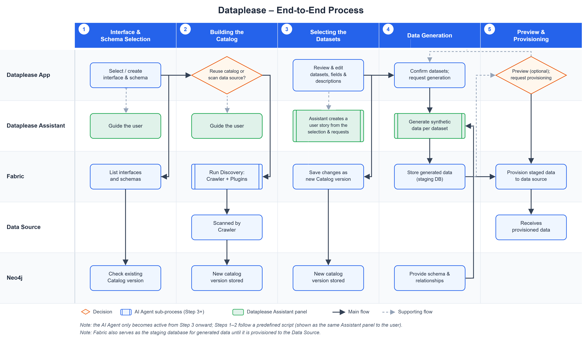

# Dataplease Overview

### Overview

Dataplease is a K2View application, built on top of the Fabric platform, that helps users generate realistic synthetic test data on demand. It is guided end-to-end by an AI agent — the **Dataplease Assistant** — which walks the user through selecting a data source, scanning its structure, choosing what to generate, and provisioning the resulting data.

Test and development environments need data that looks and behaves like production data, without exposing real, sensitive information. Dataplease addresses this by combining the following K2view tools:

* **Fabric's interfaces** to connect to any source system (databases, files, queues, etc.).
* **Fabric Discovery and Catalog solution** to scan the source's metadata: schema, tables and relationships between them.
* **Dataplease AI Agent** (with dedicated skills and sub-agents) that interprets natural-language requests into business-oriented user stories and drives the synthetic data generation process.

The result is an intuitive, self-service flow: a user points Dataplease at a data source and, with the assistant's help, ends up with freshly generated, referentially-consistent synthetic data for selected datasets.

### End-to-End Flow

1. **Interface & schema selection** – The user picks an existing Fabric interface (e.g. a SQL Server, MySQL, PostgreSQL, Salesforce, or local file source) or creates a new one, then selects the schema to work with.
2. **Building the catalog** – If a Catalog version already exists for that interface/schema, it can be reused as-is. Otherwise, Dataplease triggers a discovery process that scans the source and builds a new Catalog version, shown to the user as a live progress monitor.
3. **Selecting the datasets** – The user reviews and refines the discovered datasets, including their fields, properties  and descriptions. Descriptions and properties can be edited, for getting better results during the data generation step. Any changes are saved as a new Catalog version.
4. **Data generation** – Once the datasets are confirmed, Dataplease generates the synthetic data for the selected tables and reports per-table status, row counts, duration, and an overall execution summary (datasets processed, total rows, success rate).
5. **Data preview and provisioning** -After the data generation is completed, the user can preview this data, to validate the quality. This step is optional. Eventually, the data is provisioned to the source. The provisioning process is monitored, to report the process and success rate. 

Throughout this flow, the Dataplease Assistant panel stays present alongside the main screen, explaining each step, reacting to the user's selections, and accepting free-text requests.

### Solution Components

* **Dataplease App** is a K2view Web Application, accessible from the [K2view Web Framework](/articles/30_web_framework/01_web_framework_overview.md) by selecting **Dataplease** from the menu. 
* **Fabric** is the underlying data platform providing interfaces, discovery, and data management capabilities. See the [Fabric Overview](/articles/01_fabric_overview/README.md) for details. Minimum Fabric version to support Dataplease is V8.5.
* **Fabric Catalog App** – Dataplease relies on the Catalog app's discovery pipeline and APIs to learn a source's structure. See the [Fabric Catalog articles](/articles/39_fabric_catalog/README.md) for more on cataloging and discovery.
* **Dataplease AI Agent** is a dedicated AI Agent, composed of multiple skills and sub-agents, that guides the users through the entire workflow. 

