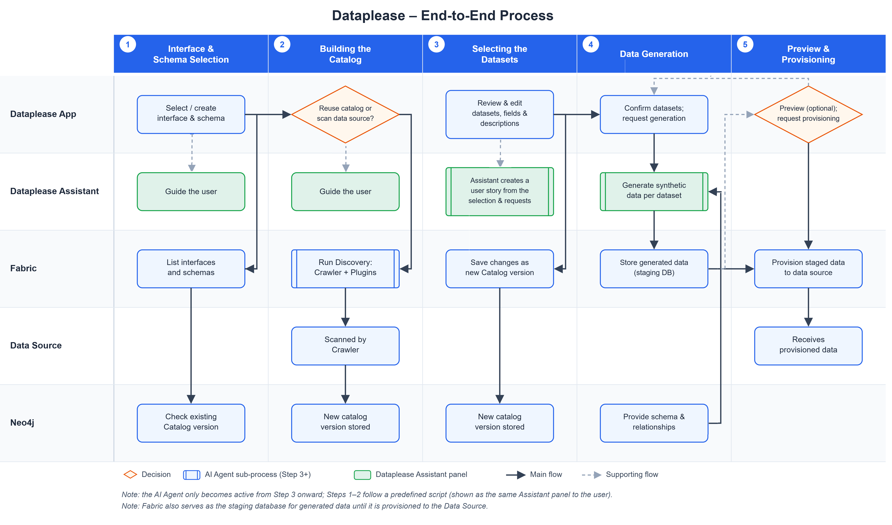

# Dataplease Overview

### Overview

Dataplease is a K2view application, built on the Fabric platform, that generates realistic synthetic test data on demand. An AI agent, the **Dataplease Assistant**, guides the user through the full process: select an interface, scan its structure, select the datasets and prompt what data to generate, then provision the data.

Test and development environments need data that looks and behaves like production data, without exposing real, sensitive information. Dataplease is designed to:

* Achieve **production-like synthetic data**, without exposing real sensitive information, with **zero implementation effort**.
* Enable a **single persona to complete the entire end-to-end flow**: run the Catalog → write prompts (natural-language requests) → evaluate the generated data → provision it to the target.

The result is an intuitive, self-service flow: a user points Dataplease at an interface and, with the assistant's help, gets freshly generated, referentially consistent synthetic data for the selected datasets.

The Dataplease MVP version supports relational databases that have a JDBC driver, such as Oracle, PostgreSQL, IBM Db2 and Microsoft SQL Server.

### End-to-End Flow

The app walks the user through the following steps:

1. **Interface and schema selection** – The user picks an existing Fabric interface or creates a new one, then selects the schema to work with.
2. **Scanning** – If a Catalog version already exists for that interface and schema, the user can reuse it. Otherwise, Dataplease starts a discovery process that scans the interface and builds a new Catalog version. The user follows the scan progress until it completes.
3. **Selecting datasets** – The user reviews and refines the discovered datasets, including the fields and their properties (such as classification and description). The user can edit descriptions and other properties to get better generation results. Dataplease saves the changes as a new Catalog version.
4. **Data generation** – Once the datasets are confirmed, the Dataplease Assistant becomes enabled, so that the user can describe the data generation request. Then the data generation begins: Dataplease generates the synthetic data for the selected datasets and reports status, row counts, duration, and an overall execution summary.
5. **Data preview** – The user can preview and evaluate the data to validate its quality.
6. **Provisioning** – The generated data is provisioned to the target system using Fabric's platform capabilities. Dataplease monitors the provisioning and reports the progress and errors, if they occur.

Throughout this flow, the Dataplease Assistant panel stays present alongside the main screen, explaining each step, reacting to the user's selections, and accepting free-text requests (after the dataset selection).

### Data Privacy: What Is Sent to the LLM

Dataplease generates data from metadata. It does not copy the original data rows. Dataplease sends the following to the LLM:

* Schema structure: datasets, fields, data types, keys and relationships.
* Catalog classifications, including PII flags.
* Discovery enrichment properties, when the related discovery plugins are active.
* The user's chat prompts and the generated business story.

**No source table rows are sent to the LLM.**

### Solution Components

Dataplease is built on the following K2view tools:

* **Dataplease App** is a K2view Web Application, accessible from the [K2view Web Framework](/articles/30_web_framework/01_web_framework_overview.md) by selecting **Dataplease** from the menu.
* **Fabric** is the underlying data platform. It provides:
  * The **interfaces** that connect to the target systems.
  * The **LLM interfaces** that run all LLM-based activities (chat, story building and data generation).
  * A Data Product (Logical Unit) that stages the generated rows before they are loaded into the target.
  * The data provisioning capabilities that deliver the generated data to the target system.

  The minimum Fabric version that supports Dataplease is V8.5.2.
* **Fabric Catalog App** – Dataplease relies on the Catalog App's **discovery** pipeline and APIs to scan the interface's metadata (schema, tables and the relationships between them) and build the Catalog. See the [Fabric Catalog articles](/articles/39_fabric_catalog/README.md) for more on cataloging and discovery.
* **Dataplease Assistant** is a dedicated AI agent, composed of multiple skills and sub-agents, that guides the user through the entire workflow. It interprets natural-language requests into a business story and drives the synthetic data generation process based on the request and the Catalog metadata. The agent:
  * Auto-generates a coherent **business story**, with or without user guidance.
  * Enforces **logical consistency across multiple disjoint datasets (tables)**.
* **AI Fusion** is the K2view agentic platform on which the Dataplease Assistant runs.

Further articles walk through each step of the [Dataplease App](dataplease_app/README.md) in more detail.
