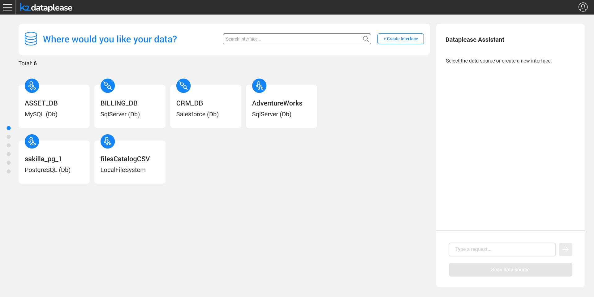
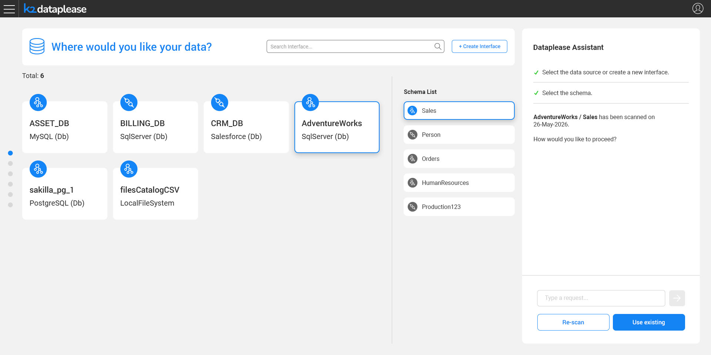

# Interface and Schema Selection

### Overview

The Dataplease flow starts with telling the app **where the data should come from**. The user picks an existing Fabric interface — a database connection (SQL Server, MySQL, PostgreSQL, Salesforce, etc.) or a local file source — or creates a new one on the fly, and then selects the schema to work with under that interface.

The interface list is retrieved using the Fabric `list interfaces` command, applying the same interface-type filter used in the Discovery Monitor UI (protocol-only interfaces such as PubSub, Kafka, etc. are excluded, since they are not relevant for data generation). A **Create Interface** action is also available, for defining a new interface without leaving the flow.

Throughout this step - and the entire Dataplease flow - the **Dataplease Assistant** panel on the right reacts to the user's selections, confirms completed steps, and explains what's needed next.

### Selecting the Schema

Once an interface is selected, its list of schemas is displayed:

For each schema, Dataplease indicates whether it was already scanned and a Catalog exists for it, or whether it would need to be discovered from the source.

Once a schema is selected, if a Catalog version already exists for that interface/schema combination, Dataplease shows when it was last created:

From here, the user decides how to proceed:

* **Use existing** - continue with the existing Catalog version, skipping the scan.
* **Re-scan** - trigger a new Discovery run on the source, to build an up-to-date Catalog version.

This decision drives the next step of the flow, described in [Building the Catalog](03_building_the_catalog.md).
