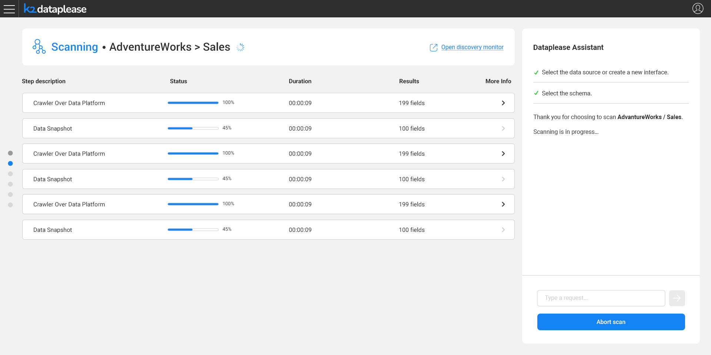
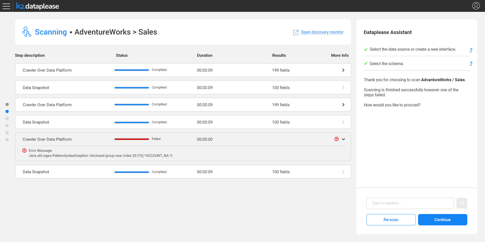
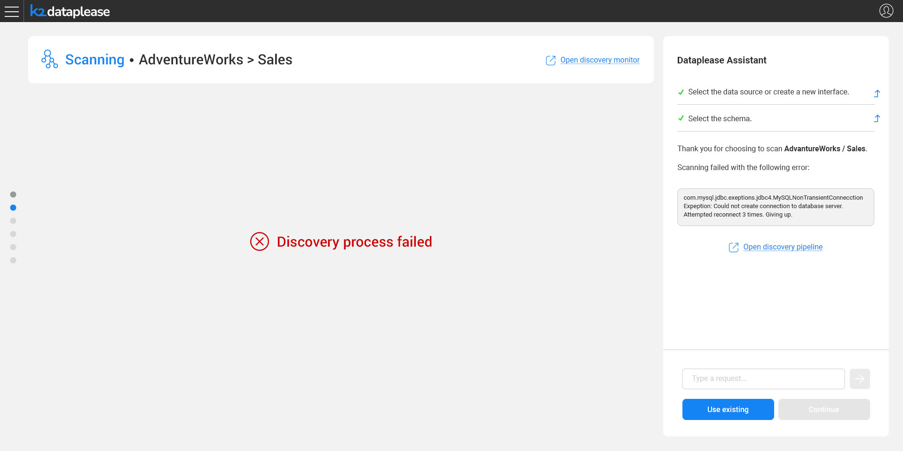

# Building the Catalog

### Overview

Once the interface and schema are selected, Dataplease needs a **Catalog** describing that schema's datasets, fields and relationships, in order to drive the data generation. Depending on the choice made in the previous step:

* If the user chose to use the existing Catalog version, this step is skipped entirely, and the datasets are loaded directly from the existing Catalog.
* If the user chose to scan the source (either because no Catalog exists yet, or a re-scan was requested), Dataplease triggers a Fabric Discovery process on the selected interface and schema.

Behind the scenes, an discovery pipeline rule is applied for the selected interface and schema (excluding other schemas of that interface), so that only the relevant part of the source is scanned. This is an ad-hoc rule and it is not saved into the permanent list of rules in pluginsOverride.discovery file.

For the full mechanics of the Discovery process and the Catalog it produces, see the [Fabric Catalog articles](/articles/39_fabric_catalog/README.md).

### Monitoring the Scan

While the Discovery job runs, Dataplease shows an inline progress monitor, mirroring the same steps shown in the Catalog app's own Discovery Monitor - crawling the data platform, taking a data snapshot, and so on - for each dataset in the schema:

An **Open discovery monitor** link is available at any point, providing a deep link into the full Catalog Discovery Monitor - for example, to terminate the job if needed.

If the scan finishes successfully with no failures, the flow automatically advances to the next step, without requiring an extra click.

### Handling Warnings and Failures

Some steps of the scan may fail while the overall job still completes - for example, a plugin failing to classify certain fields. In that case, the Dataplease Assistant surfaces the issue and lets the user decide how to proceed:

If the Discovery job fails altogether - for example, due to a connectivity issue with the source - the error is reported, and the user can either fall back to an existing (older) Catalog version, if one exists, or re-scan:

Once a usable Catalog version is available - new or existing - the flow proceeds to [Selecting the Datasets](04_selecting_the_datasets.md).
