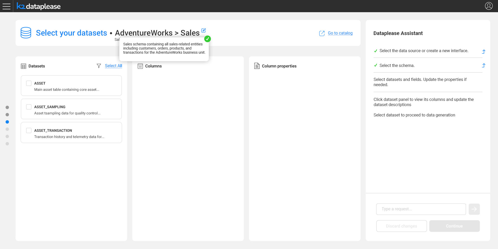
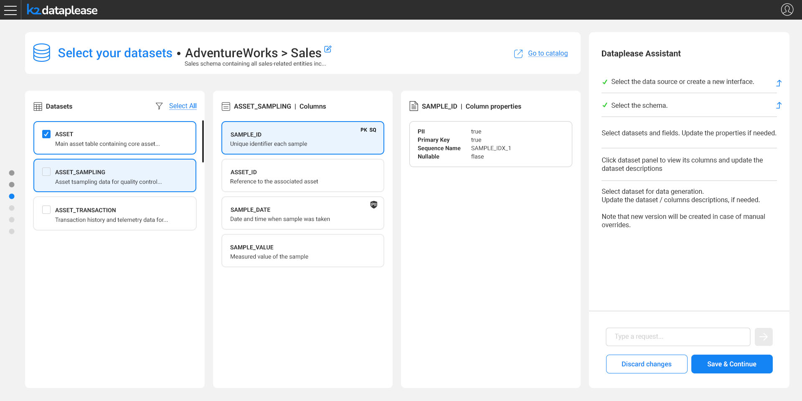

# Selecting the Datasets

### Overview

With a Catalog version in place - new or existing - the user reviews the datasets discovered under the selected schema, and picks which ones to generate synthetic data for.

The screen is split into three areas:

* **Datasets** - the list of datasets (tables) in the schema, each shown with a short description taken from the Catalog. Datasets can be selected individually, or all at once via **Select All**.
* **Columns** - once a dataset is selected, its fields are listed here.
* **Column properties** - selecting a specific column shows its properties.

### Reviewing and Refining

Clicking into a dataset shows its columns, and clicking a column shows its properties, such as **PII**, **Primary Key**, **Sequence Name** and **Nullable**:

Descriptions and properties - at the schema, dataset and field level - can all be edited directly on this screen, in order to get better results during data generation.

* If nothing is changed, the flow continues with the same Catalog version.
* If any description or property is updated, saving the change creates a new Catalog version (the same mechanism used for [manual overrides](/articles/39_fabric_catalog/catalog_app/07_manual_overrides.md) in the Catalog app). The **Continue** button becomes **Save & Continue** whenever there are pending edits.

Once the relevant datasets are selected, the flow proceeds to [Data Generation](05_data_generation.md).
