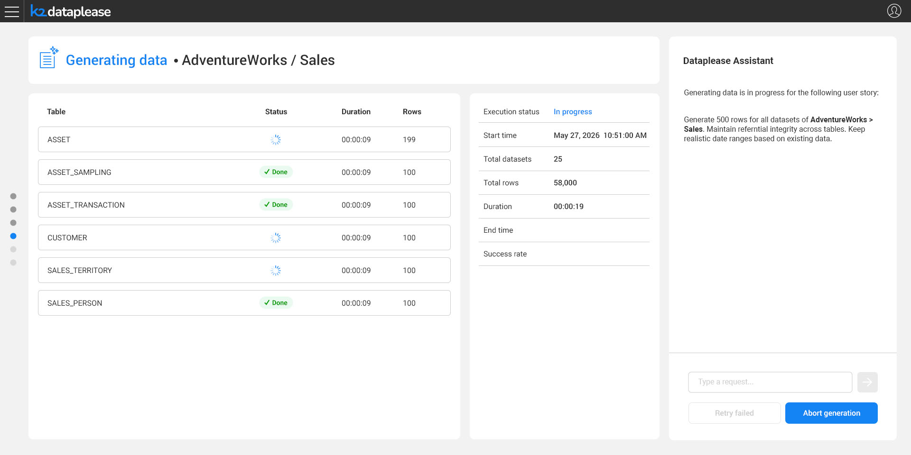
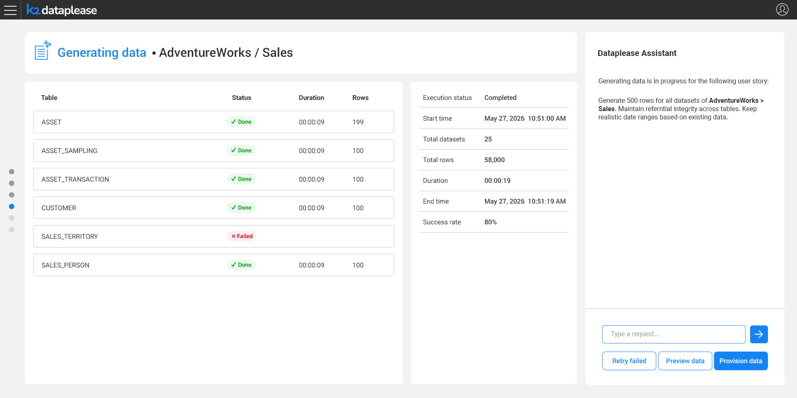

# Data Generation

### Overview

Once the datasets are confirmed, the Dataplease Assistant asks the user - in natural language - whether there are any special requests for the generation, before kicking it off:

The Assistant suggests common options as quick-pick chips, for example generating a specific number of rows per table, preserving the statistical distribution of numeric fields, or keeping realistic date ranges based on the existing data. The user can also type free-text instructions, such as maintaining referential integrity across tables. Together, these instructions form the request that the Dataplease AI Agent interprets into a coherent **data story** driving the generation, enforcing logical consistency across the selected, disjoint tables.

### Tracking the Generation

Clicking **Generate** starts the process, with per-table progress shown for the selected datasets:

The main area lists each table's status, duration and row count, while the side panel summarizes the overall job: execution status, start time, total datasets and rows, and duration.

### Reviewing the Results

Once generation completes, an execution summary is shown, including the success rate and any failed tables:

From here, the user can:

* **Retry failed** - re-run generation for tables that failed.
* **Preview data** - inspect the generated data before provisioning, as described in [Data Preview](06_data_preview.md).
* **Provision data** - skip the preview and provision the generated data directly, as described in [Provisioning](07_provisioning.md).
