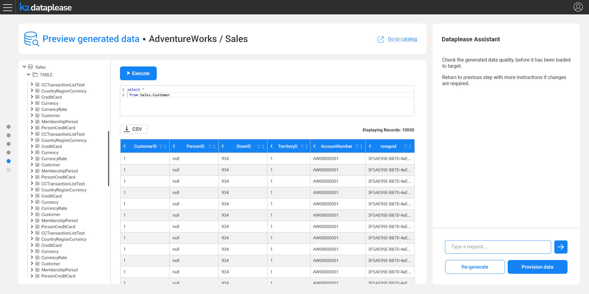

# Data Preview

### Overview

After the data generation completes, previewing the generated data is an **optional** step that lets the user validate its quality before it's delivered anywhere.

The preview screen shows the generated datasets in a tree, and lets the user run ad-hoc SQL queries against the generated data - for example, `select * from Sales.Customer` - with the results exportable to CSV. The Dataplease Assistant prompts the user to check the data quality, and to return to a previous step with more instructions if changes are needed.

Once satisfied with the data, the user proceeds to [Provisioning](07_provisioning.md).
