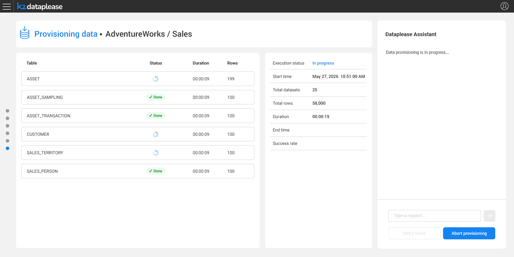
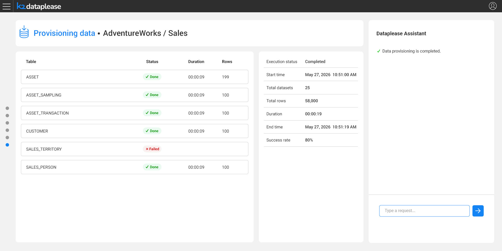

# Provisioning

### Overview

Once the generated data is ready - whether or not it was previewed first - the user provisions it to the target system, using Fabric's data management and provisioning capabilities. The provisioning process is tracked the same way as generation, with per-table progress and an overall summary:

Upon completion, the summary reflects the final status, and the Dataplease Assistant confirms the outcome:

This concludes the end-to-end Dataplease flow: from selecting a data source, through building and refining the Catalog, generating synthetic data, and finally previewing and provisioning it to the target.

*This is the first, high-level pass over the Dataplease app's steps. Further articles will go deeper into each step's behavior and configuration.*
