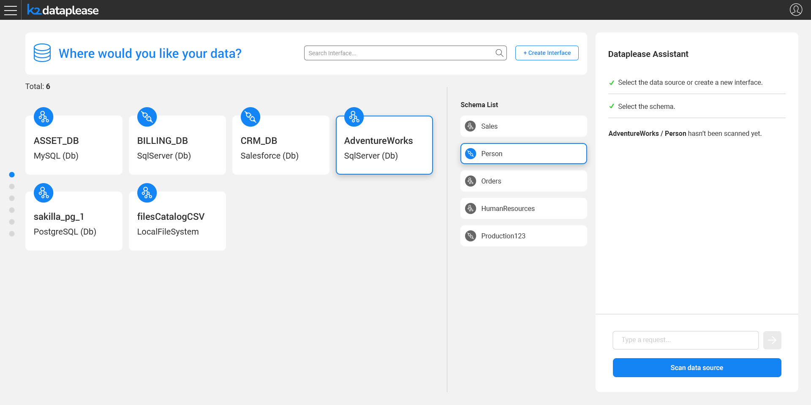
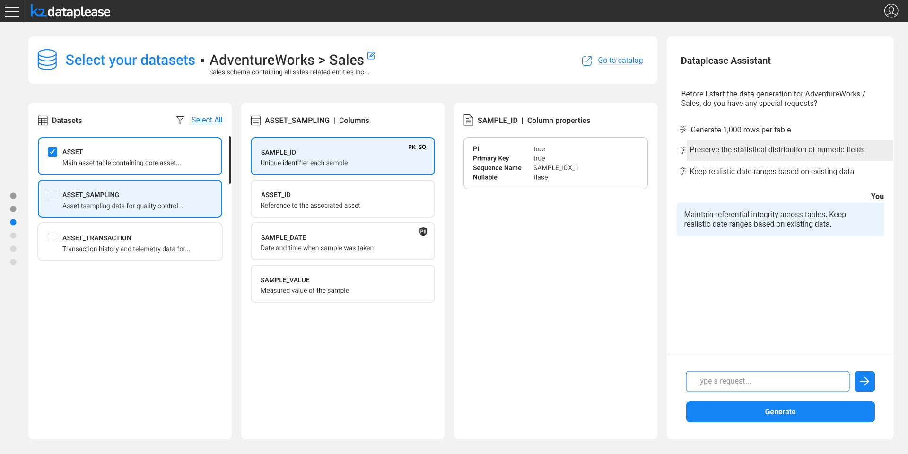

# Dataplease Assistant Overview

### Overview

Dataplease is guided end-to-end by an AI agent — the **Dataplease Assistant** — which walks the user through selecting a data source, scanning its structure, choosing what to generate, and provisioning the resulting data.

The Dataplease Assistant is a dedicated AI Agent, composed of multiple skills and sub-agents, that guides the user through the entire workflow. It interprets natural-language requests into business-oriented user stories and drives the synthetic data generation process based on the request and the Catalog metadata. The agent:

* Auto-generates a coherent **data story**, with or without user guidance.
* Enforces **logical consistency across multiple disjoint tables**.

### Guiding Script vs. AI Agent

The Dataplease Assistant panel is present throughout the entire flow, described in the [Dataplease App](/articles/Dataplease/dataplease_app/README.md) articles. However, it doesn't act as an AI Agent at every step:

* For most of the flow - interface and schema selection, building the catalog, and selecting the datasets - the Assistant panel is only a **guiding script**. It reflects the current step, confirms completed actions, and explains what's needed next, so the user keeps context of where they are in the flow. It doesn't accept free-text conversation at this stage.

* Only in [Selecting the Datasets](/articles/Dataplease/dataplease_app/04_selecting_the_datasets.md), once the datasets are selected and **Continue** (or **Save & Continue**) is clicked, the actual Dataplease AI Agent is invoked. From that point on, the panel becomes an interactive chat, and the user can freely communicate with the Agent.

### Communicating with the Agent

Once invoked, the user can interact with the Dataplease AI Agent in natural language. Examples of communication include:

* Ask questions about the schema.
* Explain what the story for the data generation should be.
* Ask for a specific number of records in the root table.

These free-text instructions, together with the Agent's own suggested quick-pick options, form the coherent data story that drives the synthetic data generation, as described in [Data Generation](/articles/Dataplease/dataplease_app/05_data_generation.md).
