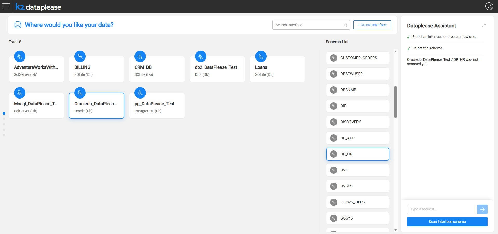
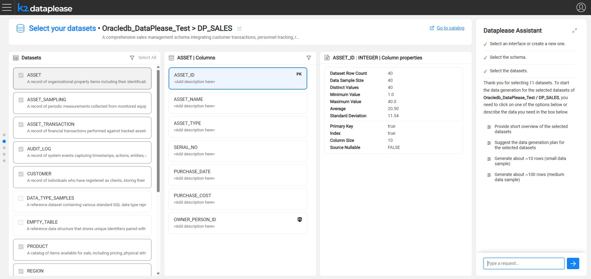

# Dataplease Assistant Overview

### Overview

The Dataplease Assistant is a dedicated AI agent, composed of multiple skills and sub-agents, that guides the user through the Dataplease flow. It interprets natural-language requests into a business story and drives the synthetic data generation based on the request and the Catalog metadata. The agent:

* Auto-generates a coherent **business story**, with or without user guidance.
* Enforces **logical consistency across multiple disjoint datasets (tables)**.

### Guiding Script vs. AI Agent

The Dataplease Assistant panel is present throughout the entire flow, described in the [Dataplease App](/articles/Dataplease/dataplease_app/README.md) articles. However, it does not act as an AI agent at every step:

* For most of the flow (interface and schema selection, scanning, and selecting the datasets), the Assistant panel is only a **guiding script**. It shows the current step, confirms completed actions and explains the next action. Thus, the user always knows the current position in the flow. At this stage, the panel does not accept free-text conversation.

  

* When the user selects the datasets and clicks **Continue** (or **Save & Continue**) in [Selecting the Datasets](/articles/Dataplease/dataplease_app/04_selecting_the_datasets.md), Dataplease starts the AI agent. The panel then becomes an interactive chat, and the user can communicate freely with the agent.

  

### Communicating with the Agent

After the agent starts, the user can communicate with it in natural language. The agent handles two types of requests:

* **Catalog questions** – Questions about the Catalog metadata of the selected datasets. The `catalog` sub-agent answers these questions.
* **Data generation** – Requests to generate synthetic data for the selected datasets.

Examples of communication include:

* Ask for an overview of the selected datasets.
* Explain what the story for the data generation should be.
* Request to generate a small or medium data sample.

The agent uses these free-text instructions and the selected quick-pick options to write the business story that drives the synthetic data generation, as described in [Data Generation](/articles/Dataplease/dataplease_app/05_data_generation.md).
